# Docker


## 参考资料

官网：https://www.docker.com/

官方文档：https://docs.docker.com/docker-for-windows/  https://docs.docker.com/

仓库地址：https://hub.docker.com/

【发布到仓库，git pull push】

b站教程：https://www.bilibili.com/video/BV1og4y1q7M4?


## 前期基础

linux基本命令，类似cd，mkdir等


## 一、Docker概述

Docker 是一个用于开发、发布和运行应用程序的开放平台。它使我们能够将应用与基础设施分离，从而快速交付软件。Docker 提供了在隔离的环境（称为**容器**）中打包和运行应用程序的能力，解决了开发、测试、生产环境不一致的核心痛点。

**核心特性**：

- **隔离性**：提供进程级别的隔离保护，使系统更加安全，可在同一主机上运行多个容器
- **轻量级**：容器体积小、启动快，但包含应用运行所需的一切，不依赖主机上安装的内容
- **可分发**：可以与他人分享容器，确保所有人得到相同的容器

Docker 利用 Linux 的 **namespace（命名空间）** 技术提供隔离的工作空间，采用 **客户端-服务器（C/S）架构**。Docker 客户端与 Docker 守护进程（Daemon）通信，后者负责构建、运行和分发 Docker 容器等繁重工作。


### Docker为什么会出现

一款产品，开发和上线两套环境，应用环境配置费时费力，而且容易出问题。尤其对于机器学习和深度学习的库更是如此，很可能存在版本问题、底层依赖冲突问题。所以发布项目时，不只是一套代码过去，而是代码+环境整体打包过去。所谓开发即运维，保证系统稳定性，提高部署效率

使用Docker后的流程：

开发：建立模型--环境--打包带上环境，即镜像--放到Docker仓库

部署：下载Docker中的镜像，直接运行即可

Docker的思想来自于集装箱，集装箱，对环境进行隔离

Docker通过隔离机制，可以将服务器利用到极致。


### 容器vs虚拟机

在容器技术出来之前，用的是虚拟机技术

#### 虚拟机原理示意图

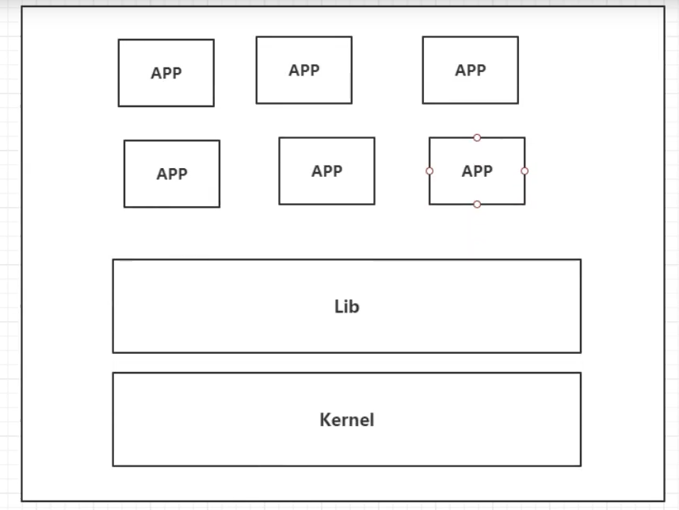

缺点：

1. 资源占用多
2. 冗余步骤多
3. 启动很慢

#### 容器化技术示意图

不是模拟的完整的操作系统

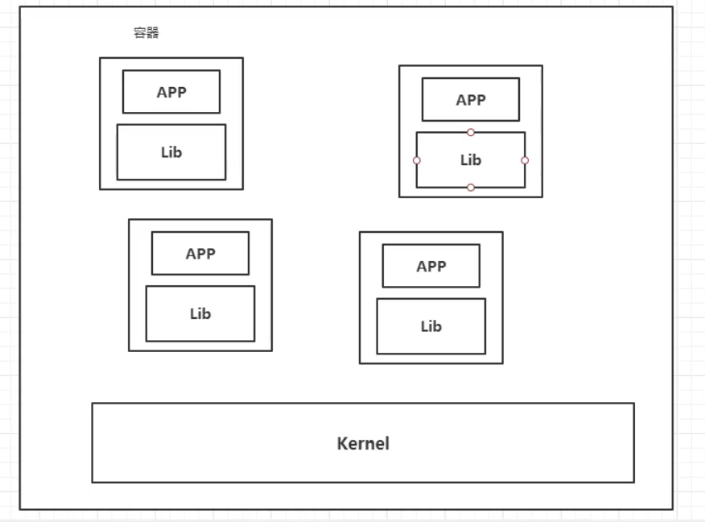

#### 二者对比

比较虚拟机和Docker的不同

|          | 传统虚拟机               | Docker        |
| -------- | ------------------------ | ------------- |
| 虚拟内容 | 硬件+完整的操作系统+软件 | APP+LIB       |
| 大小     | 笨重，通常几个G          | 轻便几个M或KB |
| 启动速度 | 慢，分钟级               | 快，秒级      |
|          |                          |               |

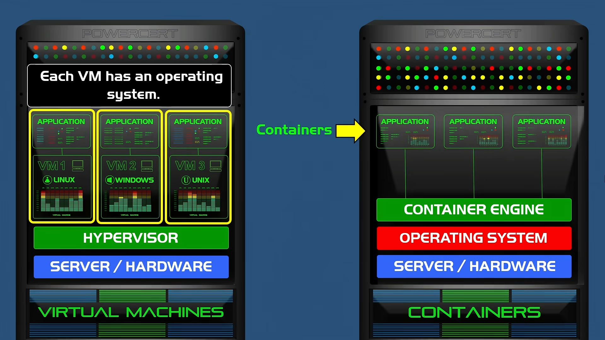


## 二、Docker安装

### 1、Docker的基本组成

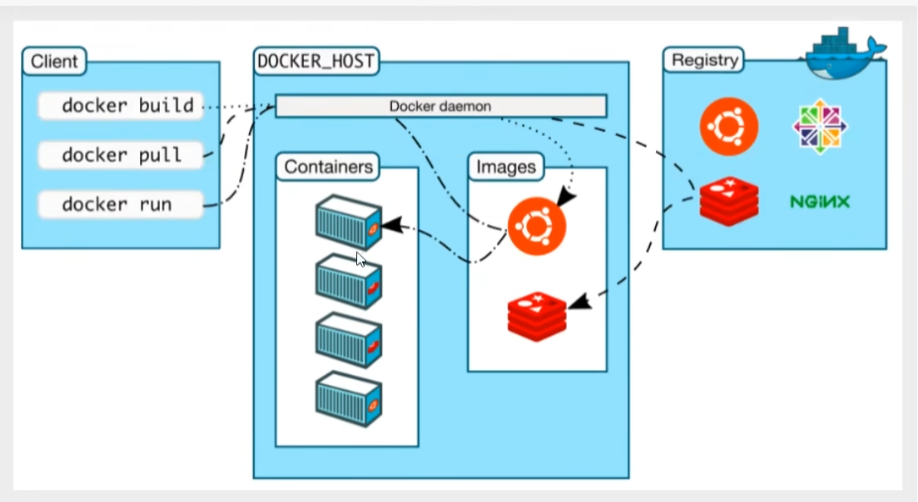

明确几个概念：

1. 镜像(image)：镜像是**轻量级、独立的可执行软件包**，包含运行应用程序所需的一切：代码、运行时、系统工具、系统库和设置。docker镜像采用**联合文件系统（UnionFS）实现分层存储**，每个镜像层都是只读的。docker镜像类似一个模板，可以通过这个模板来创建容器(container)，一个镜像可以创建多个容器，类似Python中的Class。

2. 容器(container)：容器是**镜像的运行实例**，是一个运行中的进程。容器在镜像的只读层之上添加了一个可写层，所有运行时修改都保存在这个可写层中。类似Python中通过Class创建的实例；容器可以理解为一个简易的系统

3. 仓库(repository)：仓库用于**存储和分发 Docker 镜像**。Docker Hub 是官方公共仓库，也可以搭建私有仓库

   - Docker Hub：国外的

   - 阿里云：配置镜像加速


### 2、环境准备

1. Linux命令基础
2. CentOS 7
3. 远程链接远程服务器

```
[root@devbase2 ~]# cd /
[root@devbase2 /]# ls /
bin  boot  data  dev  etc  home  lib  lib64  media  mnt  opt  proc  root  run  sbin  srv  sys  tmp  usr  var
[root@devbase2 /]# uname -r
3.10.0-1160.119.1.el7.x86_64
[root@devbase2 /]# cat /etc/os-release
NAME="CentOS Linux"
VERSION="7 (Core)"
ID="centos"
ID_LIKE="rhel fedora"
VERSION_ID="7"
PRETTY_NAME="CentOS Linux 7 (Core)"
ANSI_COLOR="0;31"
CPE_NAME="cpe:/o:centos:centos:7"
HOME_URL="https://www.centos.org/"
BUG_REPORT_URL="https://bugs.centos.org/"

CENTOS_MANTISBT_PROJECT="CentOS-7"
CENTOS_MANTISBT_PROJECT_VERSION="7"
REDHAT_SUPPORT_PRODUCT="centos"
REDHAT_SUPPORT_PRODUCT_VERSION="7"

[root@devbase2 /]#

```

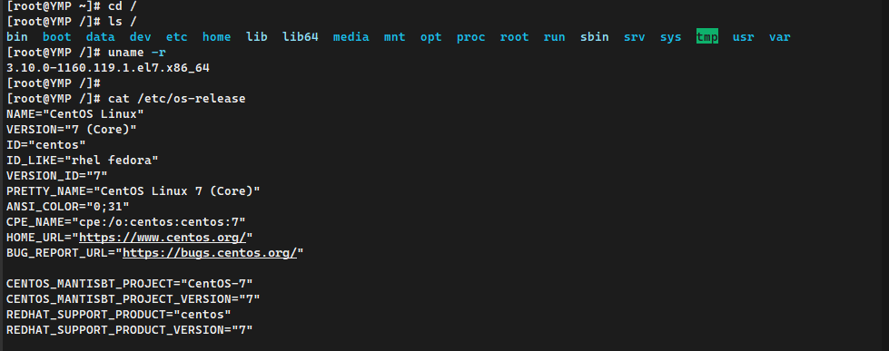

#### Centos安装

https://docs.docker.com/engine/install/centos/

### 3、卸载旧的docker版本

```
# 卸载旧的版本
$ sudo yum remove docker \
                  docker-client \
                  docker-client-latest \
                  docker-common \
                  docker-latest \
                  docker-latest-logrotate \
                  docker-logrotate \
                  docker-engine

```

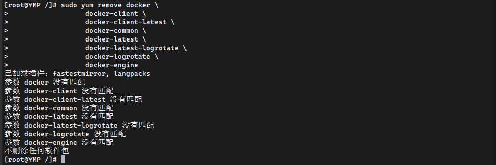

### 4、安装基本环境

```bash
# 安装基本的安装包
$ sudo yum install -y yum-utils
```

### 5、设置镜像的仓库

用国内镜像，百度搜索，docker的阿里云镜像地址

```bash
# 不要用官网默认这个！
$ sudo yum-config-manager \
    --add-repo \
    https://download.docker.com/linux/centos/docker-ce.repo # 默认是国外的

# 换成下面的阿里云镜像
$ sudo yum-config-manager \
    --add-repo \
    https://mirrors.aliyun.com/docker-ce/linux/centos/docker-ce.repo
```

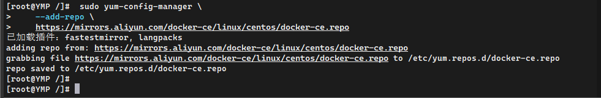


### 6、更新软件包索引

```bash
yum makecache fast
```

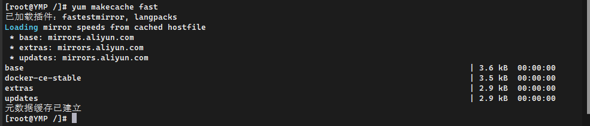


### 7、安装docker

```python
# docker-ce 社区版/ ee 企业版/docker-ce-cli docker客户端/containerd.io容器
yum install docker-ce docker-ce-cli containerd.io
```


### 8、启动Docker

```shell
# 启动Docker
systemctl start docker

# 查询docker版本
docker version

# 启动docker的helloworld进行测试
docker run hello-world
```

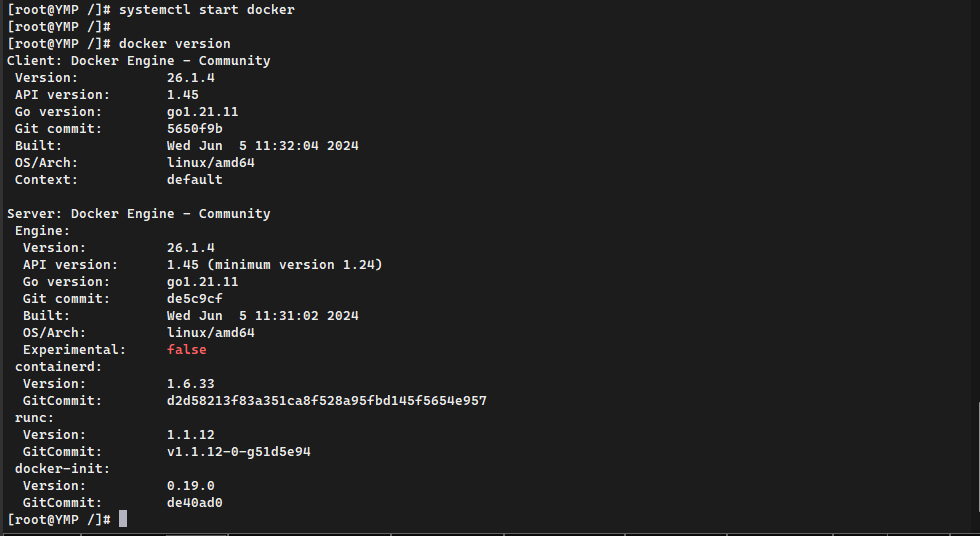

#### 启动docker的时候可能会存在网络不稳定因素，因此可以配置国内镜像加速器

通过使用国内的镜像源来替代官方源，能有效避免网络超时问题。

1. **编辑（或创建）Docker 配置文件**
   使用以下命令创建或编辑 `/etc/docker/daemon.json` 文件：

   ```bash
   sudo vi /etc/docker/daemon.json
   ```

2. **添加镜像加速器地址**
   将以下内容复制到文件中。这里提供了几个常用的国内镜像源，你可以根据需要选择或全部使用。

   ```bash
   {
     "registry-mirrors": [
       "https://docker.xuanyuan.me",
       "https://docker.1ms.run"
     ]
   }
   ## 保存生效
   ```
   
3. **重启 Docker 服务**
   保存并退出文件后，执行以下命令使配置生效:

   ```bash
   sudo systemctl daemon-reload
   sudo systemctl restart docker
   ```

4. **验证配置**
   运行以下命令，检查输出中是否包含你刚刚配置的镜像地址:

   ```bash
   docker info | grep -A 1 "Registry Mirrors"
   ```

5. **再次尝试**
   配置完成后，重新运行你的命令：

   ```bash
   docker run hello-world
   ```

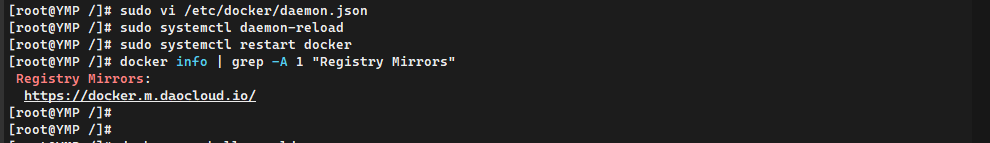

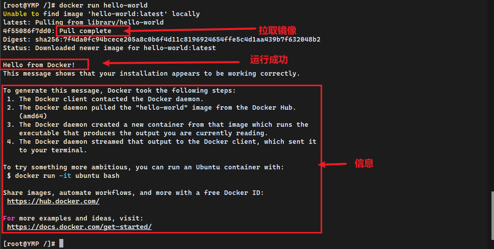

run的运行流程图

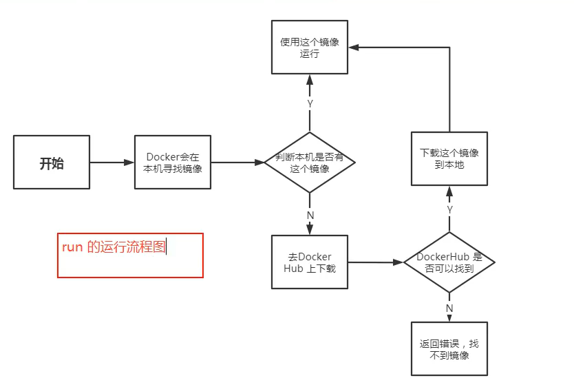

### 9、查看下载的镜像image

```shell
docker images
```

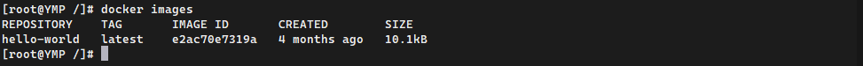

### 10、卸载Docker

```bash
# 卸载依赖
yum remove docker-ce docker-ce-cli containerd.io

# 删除资源
# docker 的默认工作路径
rm -rf /var/lib/docker 
```


## 底层原理

Docker是如何工作的？

Docker是一个Client-Server结构的系统，Docker的守护进程在主机上。通过Socket从客户端访问。DockerServer接受到Docker-Client的指令

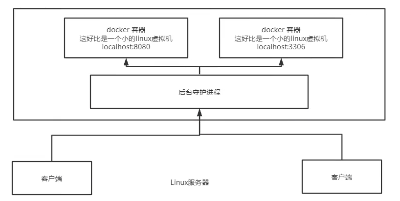

Docker为什么比VM快？

1. Docker有着比虚拟机更少的抽象层
2. docker主要用的是宿主机的内核，vm需要Guest OS

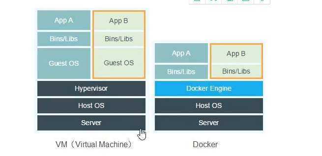

因此新建一个容器的时候，docker不需要像虚拟机一样重新加载一个操作系统内核，避免引导


## 三、Docker命令

命令地址：[官网文档](https://docs.docker.com/reference/)

### 1、帮助命令

```shell
# 显示docker的基本信息
docker version 

# 系统信息，镜像和容器的数量
docker info 

 # 全部信息
docker [命令] --help
```

### 2、镜像image管理命令

| 命令             | 说明         | 示例                                  |
| :--------------- | :----------- | :------------------------------------ |
| `docker pull`    | 拉取镜像     | `docker pull nginx:1.20`              |
| `docker images`  | 列出本地镜像 | `docker images`                       |
| `docker build`   | 构建镜像     | `docker build -t myapp:v1 .`          |
| `docker tag`     | 给镜像打标签 | `docker tag nginx:latest my-nginx:v1` |
| `docker rmi`     | 删除镜像     | `docker rmi nginx:latest`             |
| `docker inspect` | 查看镜像详情 | `docker inspect nginx:latest`         |

#### (1) docker images

```bash
[root@devbase2 /]# docker images

# 解释
REPOSITORY  # 镜像仓库源
TAG         # 镜像的标签
IMAGE ID    # 镜像的ID
CREATED     # 镜像的创建时间
SIZE 			 # 镜像的大小
```

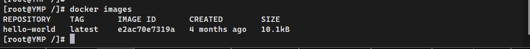

```bash
--all , -a		  Show all images (default hides intermediate images) # 显示所有
--digests		    Show digests
--filter , -f		Filter output based on conditions provided
--format		    Pretty-print images using a Go template
--no-trunc		  Don’t truncate output
--quiet , -q		Only show numeric IDs                                # 只显示id
```

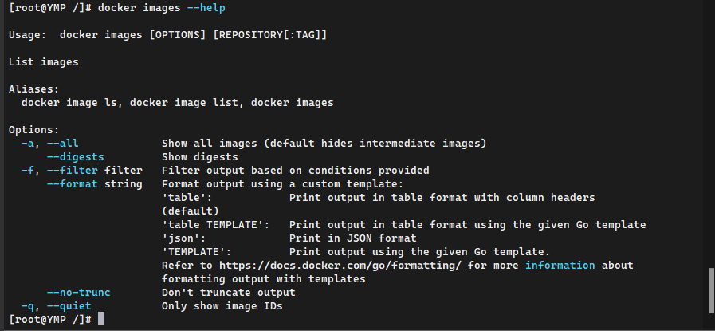


#### (2) docker search

搜索仓库中的镜像，相当于网页搜索

dockerHub 地址：[网页搜索](http://hub.docker.com)

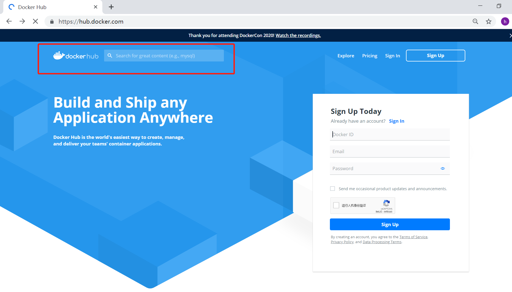

mysql

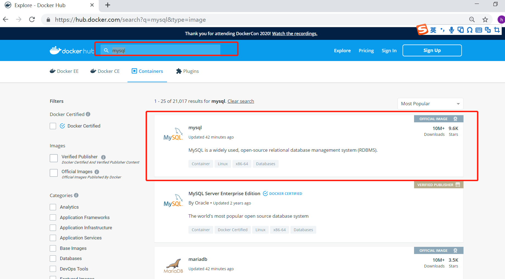

```shell
docker search mysql

docker search --help

# 解释
Options:
  -f, --filter filter   Filter output based on conditions provided
      --format string   Pretty-print search using a Go template
      --limit int       Max number of search results (default 25)
      --no-trunc        Don't truncate output
      
docker search mysql --filter=STARS=3000  # 搜索出Stars大于3000的
```


#### (3) docker pull

```bash
docker pull mysql # 下载mysql镜像，default tag，默认最新版latest
```

```shell
[root@devbase2 ~]# docker pull mysql
Using default tag: latest                  # 不写tag默认最新版
latest: Pulling from library/mysql
30627cea5424: Pull complete                # layer 分层下载，docker image的核心 联合文件系统
7e887550bdc4: Pull complete
35475b275575: Pull complete
27683f99b921: Pull complete
0bb65eb170f9: Pull complete
e480dcc782ea: Pull complete
1791a4d7fecf: Pull complete
71fa527c6c68: Pull complete
c4e766e27938: Pull complete
feffc3e2a7dd: Pull complete
Digest: sha256:66aec17cd21a956029b83f083b813073859e8355dc1a00e55df6ba02f0e32345    #签名
Status: Downloaded newer image for mysql:latest
docker.io/library/mysql:latest             # 镜像的真实地址

```

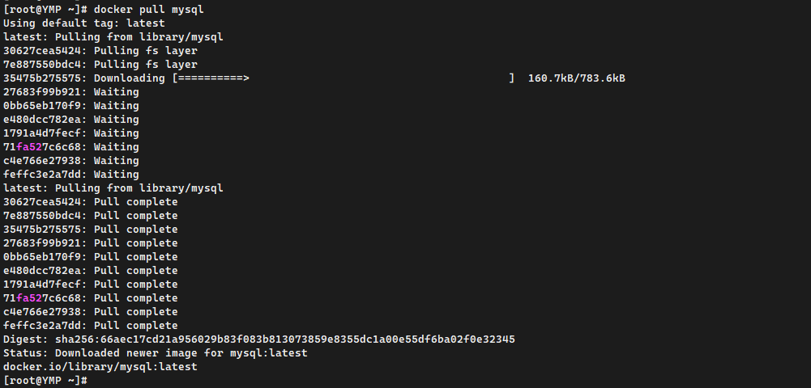

```bash
# 直接拉取最新版本的docker镜像
docker pull mysql
# 等价于
docker pull docker.io/library/mysql:latest

# 也可以指定版本下载 
docker pull mysql:5.7
```

docker镜像的版本来自于官网，版本库https://hub.docker.com/_/mysql

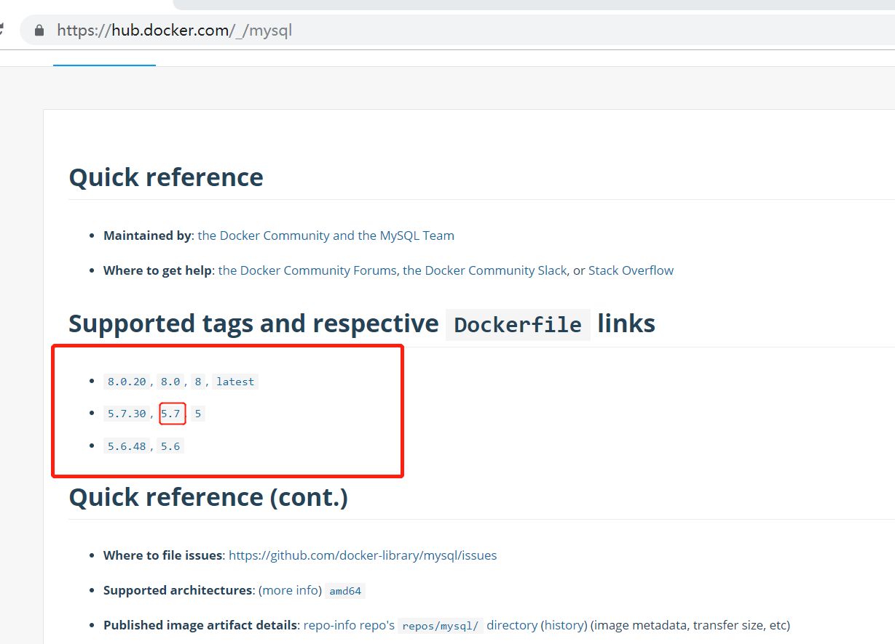

```shell
docker images
```

此时查看镜

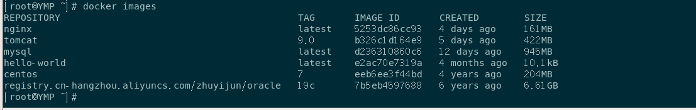


#### (4) docker rmi

```bash
# 删除一个 可以通过名称 也可以指定id -f表示删除所有
docker rmi -f 9cfcce23593a

# 删除多个 用空格分隔id
docker rmi -f id id id

# 删除所有 
# images -aq就是查所有镜像id，从而递归删除
docker rmi -f $(docker images -aq) 
```

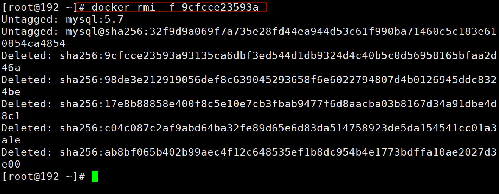


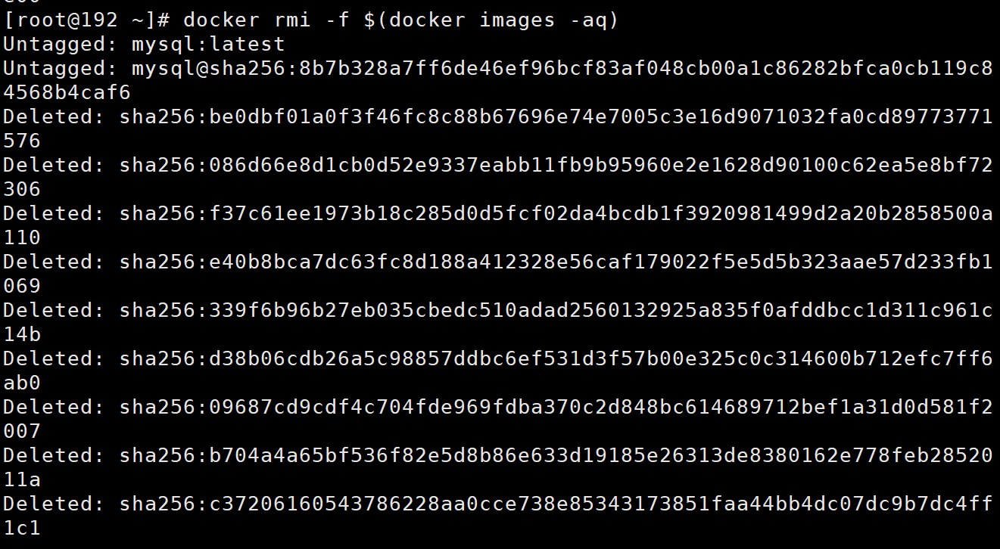


### 3、容器命令

说明：有了镜像才能创建容器，linux，下载一个centos镜像来测试学习

```bash
[root@devbase2 ~]# docker pull centos:7
7: Pulling from library/centos
2d473b07cdd5: Pull complete
Digest: sha256:be65f488b7764ad3638f236b7b515b3678369a5124c47b8d32916d6487418ea4
Status: Downloaded newer image for centos:7
docker.io/library/centos:7

```

#### 新建容器并启动

```shell
docker run [可选参数] image

# 参数说明
--name=“Name” # 容器名字，用于区分容器
-d 后台方式运行
-it 使用交互方式运行，进入容器查看内容
-p 指定容器的端口 如-p 8080::8080
	-p ip:主机端口：容器端口
	-p 主机端口:容器端口
	-p 容器端口
	
-p 随机指定端口


🎯 `-it` 的含义（两个参数组合）

- `-i`（`--interactive`）：保持容器的**标准输入（STDIN）**打开。即使你没有连接，它也始终处于等待接收输入的状态。
- `-t`（`--tty`）：为容器分配一个**伪终端（pseudo-TTY）**，让容器内的程序（比如 bash）认为自己是在一个真实的终端中运行，从而支持交互式操作（比如显示彩色提示符、响应 Ctrl+C 等）。

**合在一起 `-it` 表示：以“交互式终端”模式运行容器**，这是进入容器内部进行操作的最常用方式。
```

##### 使用命令进入centos容器

```shell
docker run -it centos /bin/bash
```

###### 踩坑实录

机器中下载的是centos7镜像，tag为7，直接使用 `docker run -it centos /bin/bash`但其中 `centos` 没有指定 tag，Docker 会默认拉取 `centos:latest`。

由于本地镜像列表中只有 `centos:7`（`eeb6ee3f44bd`），并没有 `centos:latest`，所以 Docker 尝试从远程仓库拉取 `centos:latest`，但由于网络原因（或配置的镜像加速器仍不可用）拉取失败，于是报错“Unable to find image 'centos:latest' locally”。

```shell
[root@devbase2]:/data]# docker images
REPOSITORY                                          TAG       IMAGE ID       CREATED        SIZE
nginx                                               latest    5253dc86cc93   4 days ago     161MB
tomcat                                              9.0       b326c1d164e9   5 days ago     422MB
mysql                                               latest    d236310860c6   12 days ago    945MB
hello-world                                         latest    e2ac70e7319a   4 months ago   10.1kB
centos                                              7         eeb6ee3f44bd   4 years ago    204MB
registry.cn-hangzhou.aliyuncs.com/zhuyijun/oracle   19c       7b5eb4597688   6 years ago    6.61GB
[root@devbase2]:/data]#
[root@devbase2]:~]# docker run -it centos bin/bash
Unable to find image 'centos:latest' locally

docker: Error response from daemon: Get "https://registry-1.docker.io/v2/": net/http: request canceled while waiting for connection (Client.Timeout exceeded while awaiting headers).
See 'docker run --help'.
[root@devbase2]:~]#
[root@devbase2]:~]#

```

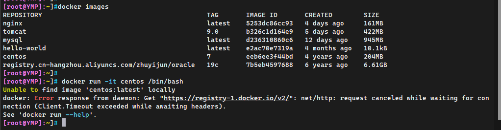

###### 使用正确命令进入

```shell
docker run -it centos:7 /bin/bash
```

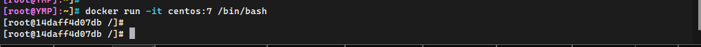

#### 进入退出容器

```bash
# 进入
docker run -it centos /bin/bash

## 注意这里面主机名，变为了centos的id

# 查看目录
ls
# 退出
exit
```

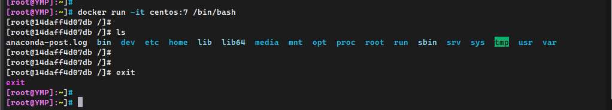


#### 查看运行的容器

```shell
# 查看正在运行的容器
docker ps
# 查看曾经运行的容器
docker ps -a
# 显示最近创建的容器，设置显示个数
docker ps -a -n=5 
# 只显示容器的编号
docker ps -aq
```

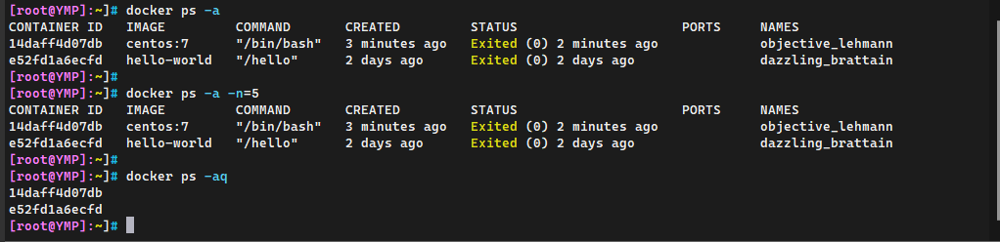


#### 退出容器

```shell
# 容器停止退出
exit
# 容器不停止退出 注意必须在英文输入法下，中文输入法不行
Ctrl + P + Q
```


#### 删除容器

```shell
# 删除指定容器 不能删除正在运行的容器，如果强制删除 rm -f
docker rm 容器id
# 删除所有容器
docker rm -f $(docker ps -aq)
# 删除所有容器
docker ps -a -q|xargs docker rm
```

```shell
[root@devbase2]:~]# docker ps -a
CONTAINER ID        IMAGE               COMMAND             CREATED             STATUS                      PORTS               NAMES
bfcea13c40cd        centos              "/bin/bash"         29 minutes ago      Up 29 minutes                                   stoic_wilson
edbd9366d959        centos              "/bin/bash"         35 minutes ago      Up 35 minutes                                   affectionate_bartik
9939864fa2e6        centos              "bin/bash"          48 minutes ago      Exited (0) 48 minutes ago                       unruffled_knuth
5f42e9930435        centos              "/bin/bash"         52 minutes ago      Exited (0) 49 minutes ago                       lucid_cannon
a89ddb393d3d        bf756fb1ae65        "/hello"            20 hours ago        Exited (0) 20 hours ago                         gracious_bhabha
[root@devbase2]:~]# docker rm 5f42e9930435
5f42e9930435
[root@devbase2]:~]# docker rm edbd9366d959      # 注意正在运行的容器不能删除
Error response from daemon: You cannot remove a running container edbd9366d9596c744dd449119269b04de2f2a494e7fc471f6396bcefd94c33fe. Stop the container before attempting removal or force remove

[root@devbase2]:~]# docker ps -aq # 所有容器id
bfcea13c40cd
edbd9366d959
9939864fa2e6
a89ddb393d3d
[root@devbase2]:~]# docker rm -f $(docker ps -aq) # 全部删除
bfcea13c40cd
edbd9366d959
9939864fa2e6
a89ddb393d3d

```


#### 启动和停止容器的操作

```shell
docker start [CONTAINER ID]
docker restart [CONTAINER ID]
docker stop [CONTAINER ID]
docker kill
```

```shell
## 查看正在运行的
[root@devbase2]:~]#docker ps
CONTAINER ID   IMAGE     COMMAND   CREATED   STATUS    PORTS     NAMES
## 查看历史运行过的
[root@devbase2]:~]# docker ps -a
CONTAINER ID   IMAGE         COMMAND       CREATED          STATUS                       PORTS     NAMES
ed8a9aa0e49a   centos:7      "/bin/bash"   26 seconds ago   Exited (127) 9 seconds ago             eloquent_swanson
f914d19b688c   centos:7      "/bin/bash"   4 minutes ago    Exited (127) 3 minutes ago             thirsty_goodall
14daff4d07db   centos:7      "/bin/bash"   29 minutes ago   Exited (0) 28 minutes ago              objective_lehmann
e52fd1a6ecfd   hello-world   "/hello"      2 days ago       Exited (0) 2 days ago                  dazzling_brattain
## 启动当前centos:7 这个容器,直接把container id 粘过来
[root@devbase2]:~]# docker start ed8a9aa0e49a
ed8a9aa0e49a
[root@devbase2]:~]#
## 查看当前运行容器 发现启动成功
[root@devbase2]:~]# docker ps
CONTAINER ID   IMAGE      COMMAND       CREATED              STATUS         PORTS     NAMES
ed8a9aa0e49a   centos:7   "/bin/bash"   About a minute ago   Up 3 seconds             eloquent_swanson
[root@devbase2]:~]#
## 停止运行
[root@devbase2]:~]# docker stop ed8a9aa0e49a
ed8a9aa0e49a
[root@devbase2]:~]#
## 再次查看 没有这个容器了
[root@devbase2]:~]#  docker ps
CONTAINER ID   IMAGE     COMMAND   CREATED   STATUS    PORTS     NAMES
[root@devbase2]:~]#

```

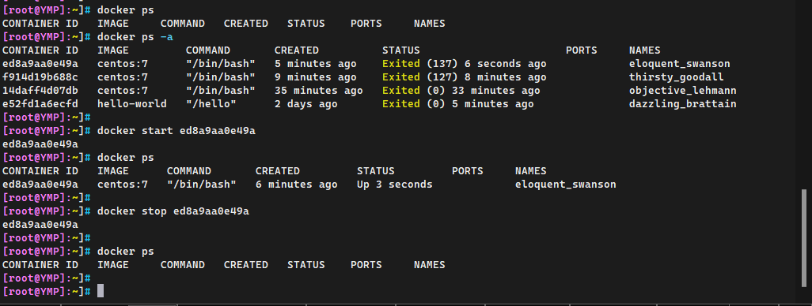

### 4、常用其他命令

#### (1) 后台启动docker

```shell
docker run -d -it centos:7 /bin/bash
# 用docker ps 查看的时候,未查询到运行中的镜像
docker ps 
```

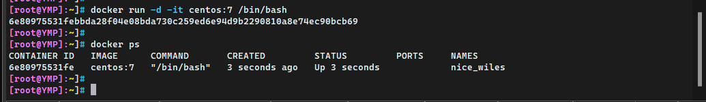


#### (2) 查看日志

```shell
[root@devbase2]:~]#docker logs --help

Usage:	docker logs [OPTIONS] CONTAINER

Fetch the logs of a container

Options:
      --details        Show extra details provided to logs
  -f, --follow         Follow log output
      --since string   Show logs since timestamp (e.g.
                       2013-01-02T13:23:37) or relative
                       (e.g. 42m for 42 minutes)
      --tail string    Number of lines to show from the
                       end of the logs (default "all")
  -t, --timestamps     Show timestamps # 时间戳
      --until string   Show logs before a timestamp (e.g.
                       2013-01-02T13:23:37) or relative
                       (e.g. 42m for 42 minutes)

## 运行image->执行一些命令->退出容器->查看docker log
[root@devbase2]:~]#docker run -it centos:7 /bin/bash
[root@devbase2]:~]#docker ps
[root@devbase2]:~]#docker ps -a
[root@devbase2]:~]#docker logs -tf a34faa845435
[root@devbase2]:~]#

```

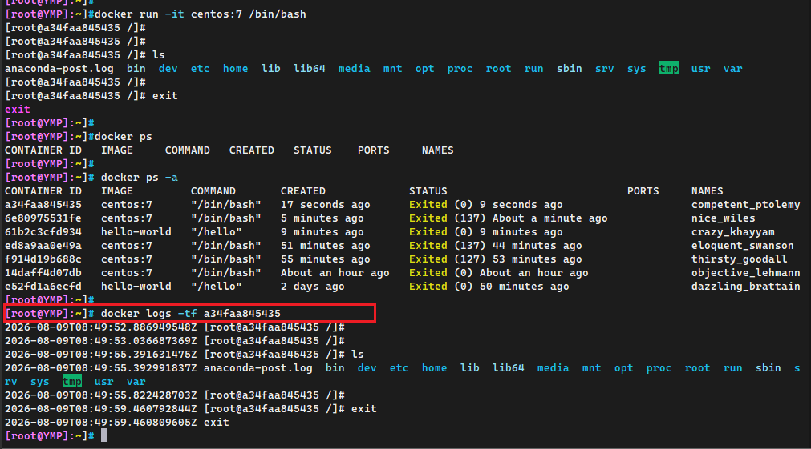


```shell
whiel true;do echo shenzai;sleep 
```


#### (3) 查看正在运行的容器信息

```shell
[root@devbase2]:~]#
[root@devbase2]:~]# docker inspect a34faa845435
[
    {
        "Id": "a34faa8454355bdc41ea44649317817276fdb8cdbdc6359a18e51ae44839d6ff",
        "Created": "2026-08-09T08:49:51.502794029Z",
        "Path": "/bin/bash",
        "Args": [],
        "State": {
            "Status": "exited",
            "Running": false,
            "Paused": false,
            "Restarting": false,
            "OOMKilled": false,
            "Dead": false,
            "Pid": 0,
            "ExitCode": 0,
            "Error": "",
            "StartedAt": "2026-08-09T08:49:51.736374968Z",
            "FinishedAt": "2026-08-09T08:49:59.477319083Z"
        },
        "Image": "sha256:eeb6ee3f44bd0b5103bb561b4c16bcb82328cfe5809ab675bb17ab3a16c517c9",
        "ResolvConfPath": "/var/lib/docker/containers/a34faa8454355bdc41ea44649317817276fdb8cdbdc6359a18e51ae44839d6ff/resolv.conf",
        "HostnamePath": "/var/lib/docker/containers/a34faa8454355bdc41ea44649317817276fdb8cdbdc6359a18e51ae44839d6ff/hostname",
        "HostsPath": "/var/lib/docker/containers/a34faa8454355bdc41ea44649317817276fdb8cdbdc6359a18e51ae44839d6ff/hosts",
        "LogPath": "/var/lib/docker/containers/a34faa8454355bdc41ea44649317817276fdb8cdbdc6359a18e51ae44839d6ff/a34faa8454355bdc41ea44649317817276fdb8cdbdc6359a18e51ae44839d6ff-json.log",
        "Name": "/competent_ptolemy",
        "RestartCount": 0,
        "Driver": "overlay2",
        "Platform": "linux",
        "MountLabel": "",
        "ProcessLabel": "",
        "AppArmorProfile": "",
        "ExecIDs": null,
        "HostConfig": {
            "Binds": null,
            "ContainerIDFile": "",
            "LogConfig": {
                "Type": "json-file",
                "Config": {}
            },
            "NetworkMode": "bridge",
            "PortBindings": {},
            "RestartPolicy": {
                "Name": "no",
                "MaximumRetryCount": 0
            },
            "AutoRemove": false,
            "VolumeDriver": "",
            "VolumesFrom": null,
            "ConsoleSize": [
                47,
                124
            ],
            "CapAdd": null,
            "CapDrop": null,
            "CgroupnsMode": "host",
            "Dns": [],
            "DnsOptions": [],
            "DnsSearch": [],
            "ExtraHosts": null,
            "GroupAdd": null,
            "IpcMode": "private",
            "Cgroup": "",
            "Links": null,
            "OomScoreAdj": 0,
            "PidMode": "",
            "Privileged": false,
            "PublishAllPorts": false,
            "ReadonlyRootfs": false,
            "SecurityOpt": null,
            "UTSMode": "",
            "UsernsMode": "",
            "ShmSize": 67108864,
            "Runtime": "runc",
            "Isolation": "",
            "CpuShares": 0,
            "Memory": 0,
            "NanoCpus": 0,
            "CgroupParent": "",
            "BlkioWeight": 0,
            "BlkioWeightDevice": [],
            "BlkioDeviceReadBps": [],
            "BlkioDeviceWriteBps": [],
            "BlkioDeviceReadIOps": [],
            "BlkioDeviceWriteIOps": [],
            "CpuPeriod": 0,
            "CpuQuota": 0,
            "CpuRealtimePeriod": 0,
            "CpuRealtimeRuntime": 0,
            "CpusetCpus": "",
            "CpusetMems": "",
            "Devices": [],
            "DeviceCgroupRules": null,
            "DeviceRequests": null,
            "MemoryReservation": 0,
            "MemorySwap": 0,
            "MemorySwappiness": null,
            "OomKillDisable": false,
            "PidsLimit": null,
            "Ulimits": [],
            "CpuCount": 0,
            "CpuPercent": 0,
            "IOMaximumIOps": 0,
            "IOMaximumBandwidth": 0,
            "MaskedPaths": [
                "/proc/asound",
                "/proc/acpi",
                "/proc/kcore",
                "/proc/keys",
                "/proc/latency_stats",
                "/proc/timer_list",
                "/proc/timer_stats",
                "/proc/sched_debug",
                "/proc/scsi",
                "/sys/firmware",
                "/sys/devices/virtual/powercap"
            ],
            "ReadonlyPaths": [
                "/proc/bus",
                "/proc/fs",
                "/proc/irq",
                "/proc/sys",
                "/proc/sysrq-trigger"
            ]
        },
        "GraphDriver": {
            "Data": {
                "LowerDir": "/var/lib/docker/overlay2/f801c152a90045b0d006f3e3974831332ef6943288901202403d348879cc6f20-init/diff:/var/lib/docker/overlay2/c70eac7eda591e4a308675a1fe5133dc785804aa3d0aa57c7cdcf0e89e42e188/diff",
                "MergedDir": "/var/lib/docker/overlay2/f801c152a90045b0d006f3e3974831332ef6943288901202403d348879cc6f20/merged",
                "UpperDir": "/var/lib/docker/overlay2/f801c152a90045b0d006f3e3974831332ef6943288901202403d348879cc6f20/diff",
                "WorkDir": "/var/lib/docker/overlay2/f801c152a90045b0d006f3e3974831332ef6943288901202403d348879cc6f20/work"
            },
            "Name": "overlay2"
        },
        "Mounts": [],
        "Config": {
            "Hostname": "a34faa845435",
            "Domainname": "",
            "User": "",
            "AttachStdin": true,
            "AttachStdout": true,
            "AttachStderr": true,
            "Tty": true,
            "OpenStdin": true,
            "StdinOnce": true,
            "Env": [
                "PATH=/usr/local/sbin:/usr/local/bin:/usr/sbin:/usr/bin:/sbin:/bin"
            ],
            "Cmd": [
                "/bin/bash"
            ],
            "Image": "centos:7",
            "Volumes": null,
            "WorkingDir": "",
            "Entrypoint": null,
            "OnBuild": null,
            "Labels": {
                "org.label-schema.build-date": "20201113",
                "org.label-schema.license": "GPLv2",
                "org.label-schema.name": "CentOS Base Image",
                "org.label-schema.schema-version": "1.0",
                "org.label-schema.vendor": "CentOS",
                "org.opencontainers.image.created": "2020-11-13 00:00:00+00:00",
                "org.opencontainers.image.licenses": "GPL-2.0-only",
                "org.opencontainers.image.title": "CentOS Base Image",
                "org.opencontainers.image.vendor": "CentOS"
            }
        },
        "NetworkSettings": {
            "Bridge": "",
            "SandboxID": "90668e61a51ea655614e1553a7978461cf207f116b6525a26e26c98a147f5b14",
            "SandboxKey": "/var/run/docker/netns/90668e61a51e",
            "Ports": {},
            "HairpinMode": false,
            "LinkLocalIPv6Address": "",
            "LinkLocalIPv6PrefixLen": 0,
            "SecondaryIPAddresses": null,
            "SecondaryIPv6Addresses": null,
            "EndpointID": "",
            "Gateway": "",
            "GlobalIPv6Address": "",
            "GlobalIPv6PrefixLen": 0,
            "IPAddress": "",
            "IPPrefixLen": 0,
            "IPv6Gateway": "",
            "MacAddress": "",
            "Networks": {
                "bridge": {
                    "IPAMConfig": null,
                    "Links": null,
                    "Aliases": null,
                    "MacAddress": "",
                    "NetworkID": "8f8aa1a6f97d4ce25fd5e2071f06db0742e4f555730d15b090a28a2f1aa58baf",
                    "EndpointID": "",
                    "Gateway": "",
                    "IPAddress": "",
                    "IPPrefixLen": 0,
                    "IPv6Gateway": "",
                    "GlobalIPv6Address": "",
                    "GlobalIPv6PrefixLen": 0,
                    "DriverOpts": null,
                    "DNSNames": null
                }
            }
        }
    }
]
[root@devbase2]:~]#
```


#### (4) 进入当前正在运行的容器

```shell
## 进入容器后开启一个新的终端，可以在里面操作(常用)
docker exec 
## 进入容器正在执行的终端，不会启动新的进程
docker attach 
```

##### demo

前置：运行容器

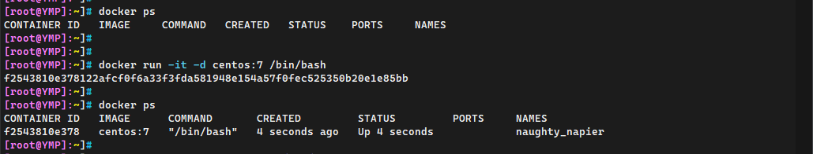

###### 方式一：使用`docker exec [CONTAINER ID]`

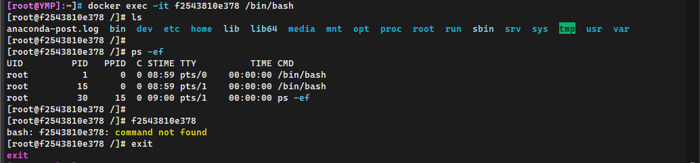

###### 方式二：使用`docker attach [CONTAINER ID]`

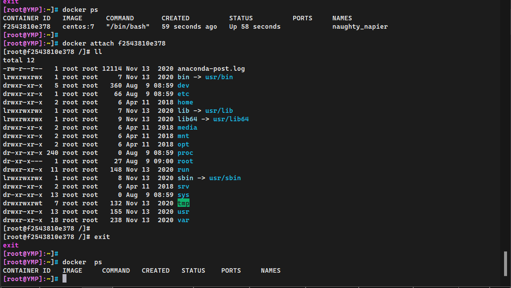


##### 🆚 核心区别对比

| 特性         | `docker exec`                                                | `docker attach`                                              |
| :----------- | :----------------------------------------------------------- | :----------------------------------------------------------- |
| **进程性质** | **创建并启动一个全新的进程**（如新的 `/bin/bash`）           | **连接到容器内已存在的、正在运行的主进程**（PID 1）          |
| **终端模式** | 开启一个新的终端会话                                         | 复用容器当前的标准输入/输出（STDIN/STDOUT/STDERR）           |
| **退出影响** | `exit` 退出时，**仅结束这个新进程**，容器本身**继续运行**（只要主进程还在） | `exit` 退出时，**会直接终止容器的主进程**，导致容器**停止运行** |
| **常用场景** | 进入容器执行管理操作、调试、查看日志（**最常用**）           | 查看容器主进程的实时输出，或向主进程发送标准输入（较少用）   |


#### (5) 从容器内拷贝文件到主机上

##### 首先运行docker

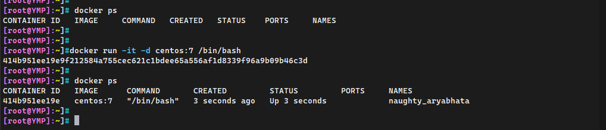

使用另一个sess登陆容器进行拷贝文件到主机

```shell
## 进入正在运行的容器
[root@devbase2]:~]# docker ps
CONTAINER ID   IMAGE      COMMAND       CREATED         STATUS         PORTS     NAMES
414b951ee19e   centos:7   "/bin/bash"   3 minutes ago   Up 3 minutes             naughty_aryabhata
[root@devbase2]:~]#
[root@devbase2]:~]# docker attach 414b951ee19e

## 在目录中创建test.c文件
[root@414b951ee19e /]# touch test.c

## 退出并停止容器
[root@414b951ee19e /]# exit
exit

## 查看现在运行的容器
[root@devbase2]:~]# docker ps
CONTAINER ID   IMAGE     COMMAND   CREATED   STATUS    PORTS     NAMES
[root@devbase2]:~]#
## 容器虽然被停止，但是数据都会保留
[root@devbase2]:~]# docker ps -a
CONTAINER ID   IMAGE         COMMAND       CREATED             STATUS                           PORTS     NAMES
414b951ee19e   centos:7      "/bin/bash"   3 minutes ago       Exited (0) 15 seconds ago                  naughty_aryabhata
f2543810e378   centos:7      "/bin/bash"   10 minutes ago      Exited (0) 7 minutes ago                   naughty_napier
a34faa845435   centos:7      "/bin/bash"   20 minutes ago      Exited (0) 20 minutes ago                  competent_ptolemy
6e80975531fe   centos:7      "/bin/bash"   25 minutes ago      Exited (137) 21 minutes ago                nice_wiles
61b2c3cfd934   hello-world   "/hello"      29 minutes ago      Exited (0) 29 minutes ago                  crazy_khayyam
ed8a9aa0e49a   centos:7      "/bin/bash"   About an hour ago   Exited (137) About an hour ago             eloquent_swanson
f914d19b688c   centos:7      "/bin/bash"   About an hour ago   Exited (127) About an hour ago             thirsty_goodall
14daff4d07db   centos:7      "/bin/bash"   2 hours ago         Exited (0) 2 hours ago                     objective_lehmann
e52fd1a6ecfd   hello-world   "/hello"      2 days ago          Exited (0) About an hour ago               dazzling_brattain
[root@devbase2]:~]#
## 容器数据拷贝到主机
[root@devbase2]:~]# docker cp 414b951ee19e:/test.c /data
Successfully copied 1.54kB to /data
[root@devbase2]:~]#
[root@devbase2]:~]# ll /data/test.c
-rw-r--r-- 1 root root 0 8月   9 17:09 /data/test.c
[root@devbase2]:~]#

# 拷贝是一个手动过程，未来我们使用 -v 卷的技术，可以实现自动同步
```


#### (6) 查看内容占用

```shell
docker stats
```

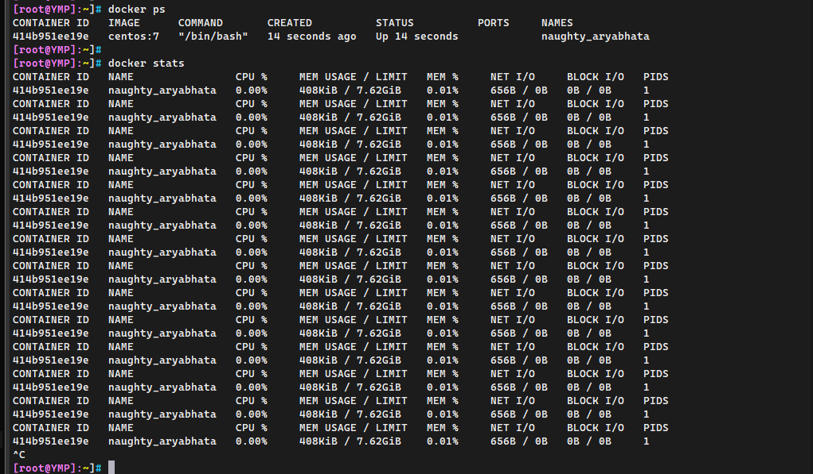

#### 小结

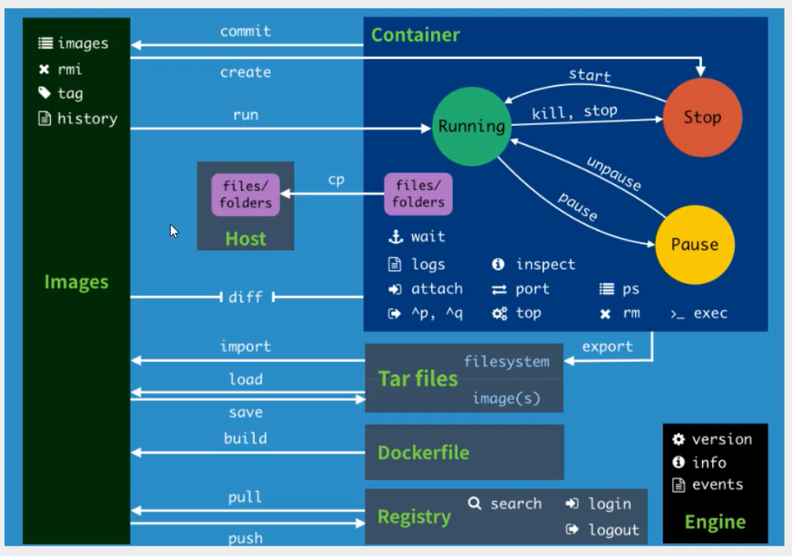

```shell
[root@devbase2]:~# docker --help

Usage:  docker [OPTIONS] COMMAND

A self-sufficient runtime for containers

Common Commands:
  run         Create and run a new container from an image
  exec        Execute a command in a running container
  ps          List containers
  build       Build an image from a Dockerfile
  pull        Download an image from a registry
  push        Upload an image to a registry
  images      List images
  login       Log in to a registry
  logout      Log out from a registry
  search      Search Docker Hub for images
  version     Show the Docker version information
  info        Display system-wide information

Management Commands:
  builder     Manage builds
  buildx*     Docker Buildx
  compose*    Docker Compose
  container   Manage containers
  context     Manage contexts
  image       Manage images
  manifest    Manage Docker image manifests and manifest lists
  network     Manage networks
  plugin      Manage plugins
  system      Manage Docker
  trust       Manage trust on Docker images
  volume      Manage volumes

Swarm Commands:
  swarm       Manage Swarm

Commands:
  attach      Attach local standard input, output, and error streams to a running container
  commit      Create a new image from a container's changes
  cp          Copy files/folders between a container and the local filesystem
  create      Create a new container
  diff        Inspect changes to files or directories on a container's filesystem
  events      Get real time events from the server
  export      Export a container's filesystem as a tar archive
  history     Show the history of an image
  import      Import the contents from a tarball to create a filesystem image
  inspect     Return low-level information on Docker objects
  kill        Kill one or more running containers
  load        Load an image from a tar archive or STDIN
  logs        Fetch the logs of a container
  pause       Pause all processes within one or more containers
  port        List port mappings or a specific mapping for the container
  rename      Rename a container
  restart     Restart one or more containers
  rm          Remove one or more containers
  rmi         Remove one or more images
  save        Save one or more images to a tar archive (streamed to STDOUT by default)
  start       Start one or more stopped containers
  stats       Display a live stream of container(s) resource usage statistics
  stop        Stop one or more running containers
  tag         Create a tag TARGET_IMAGE that refers to SOURCE_IMAGE
  top         Display the running processes of a container
  unpause     Unpause all processes within one or more containers
  update      Update configuration of one or more containers
  wait        Block until one or more containers stop, then print their exit codes

Global Options:
      --config string      Location of client config files (default "/root/.docker")
  -c, --context string     Name of the context to use to connect to the daemon (overrides DOCKER_HOST env var and default
                           context set with "docker context use")
  -D, --debug              Enable debug mode
  -H, --host list          Daemon socket to connect to
  -l, --log-level string   Set the logging level ("debug", "info", "warn", "error", "fatal") (default "info")
      --tls                Use TLS; implied by --tlsverify
      --tlscacert string   Trust certs signed only by this CA (default "/root/.docker/ca.pem")
      --tlscert string     Path to TLS certificate file (default "/root/.docker/cert.pem")
      --tlskey string      Path to TLS key file (default "/root/.docker/key.pem")
      --tlsverify          Use TLS and verify the remote
  -v, --version            Print version information and quit

Run 'docker COMMAND --help' for more information on a command.

For more help on how to use Docker, head to https://docs.docker.com/go/guides/
[root@devbase2]:#
```


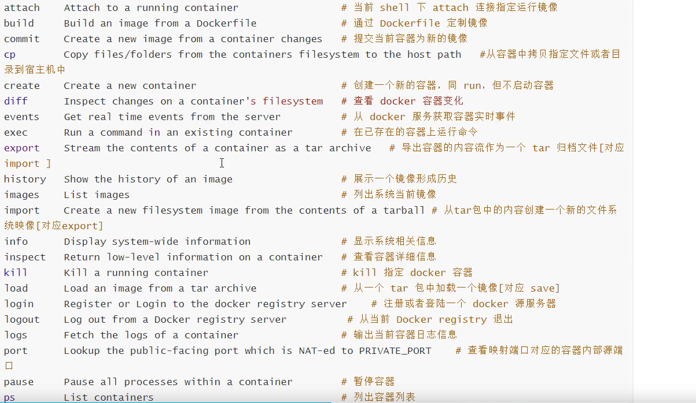

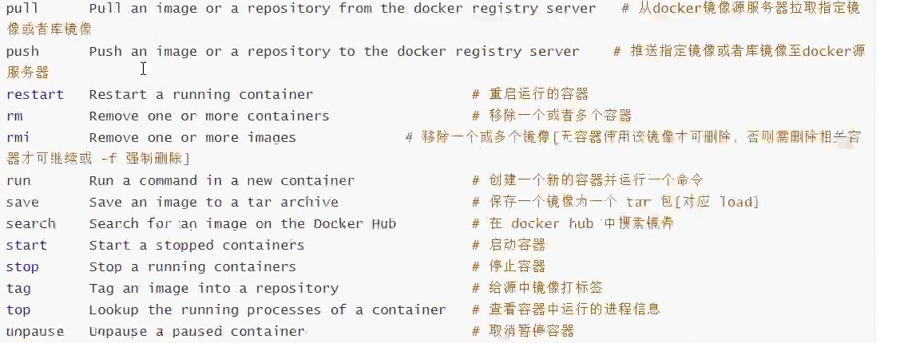

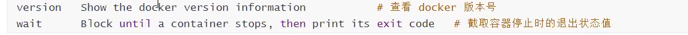


#### 作业练习

##### (1) 部署Nginx

```shell
# 官网搜索nginx，可以看到帮助文档

# 下载镜像
[root@devbase2 ~]# docker pull nginx
Using default tag: latest
latest: Pulling from library/nginx
26c307b5e35a: Pulling fs layer
3c55dc422a81: Pulling fs layer
d84ae7b21412: Pulling fs layer
c0df8d325117: Waiting
b8b80b9bc028: Waiting
f5de6e85ac74: Waiting
5a4222b844e8: Waiting
latest: Pulling from library/nginx
26c307b5e35a: Pull complete
3c55dc422a81: Pull complete
d84ae7b21412: Pull complete
c0df8d325117: Pull complete
b8b80b9bc028: Pull complete
f5de6e85ac74: Pull complete
5a4222b844e8: Pull complete
Digest: sha256:8541484afbc9c8a5a8a99b379568ebbc957f658583ec9448fc43104229c03cf8
Status: Downloaded newer image for nginx:latest
docker.io/library/nginx:latest

# 查看镜像
[root@devbase2]:~# docker images
REPOSITORY                                          TAG       IMAGE ID       CREATED        SIZE
nginx                                               latest    5253dc86cc93   5 days ago     161MB
tomcat                                              9.0       b326c1d164e9   6 days ago     422MB
mysql                                               latest    d236310860c6   13 days ago    945MB
hello-world                                         latest    e2ac70e7319a   4 months ago   10.1kB
centos                                              7         eeb6ee3f44bd   4 years ago    204MB
registry.cn-hangzhou.aliyuncs.com/zhuyijun/oracle   19c       7b5eb4597688   6 years ago    6.61GB
[root@devbase2]:~#

# 运行测试
# -d 后台运行，--name 命名，-p 暴露端口，3344服务器、宿主机的端口，容器内部端口
[root@192 home]# docker run -d --name nginx01 -p:3344:80 nginx
38dbf7bdcaef232d269b7184d91e44e06087181b5ee929494e177ad526810fa8
[root@192 home]# docker ps
CONTAINER ID        IMAGE               COMMAND                  CREATED             STATUS              PORTS                  NAMES
38dbf7bdcaef        nginx               "/docker-entrypoint.…"   7 seconds ago       Up 6 seconds        0.0.0.0:3344->80/tcp   nginx01

```

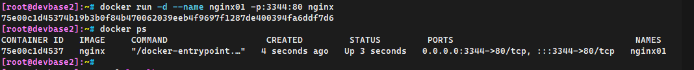

###### a) 本机使用curl 直接访问

```shell
## 使用3344端口访问
[root@devbase2]:~# curl localhost:3344
<!DOCTYPE html>
<html>
<head>
<title>Welcome to nginx!</title>
<style>
html { color-scheme: light dark; }
body { width: 35em; margin: 0 auto;
font-family: Tahoma, Verdana, Arial, sans-serif; }
</style>
</head>
<body>
<h1>Welcome to nginx!</h1>
<p>If you see this page, nginx is successfully installed and working.
Further configuration is required for the web server, reverse proxy,
API gateway, load balancer, content cache, or other features.</p>

<p>For online documentation and support please refer to
<a href="https://nginx.org/">nginx.org</a>.<br/>
To engage with the community please visit
<a href="https://community.nginx.org/">community.nginx.org</a>.<br/>
For enterprise grade support, professional services, additional
security features and capabilities please refer to
<a href="https://f5.com/nginx">f5.com/nginx</a>.</p>

<p><em>Thank you for using nginx.</em></p>
</body>
</html>
```

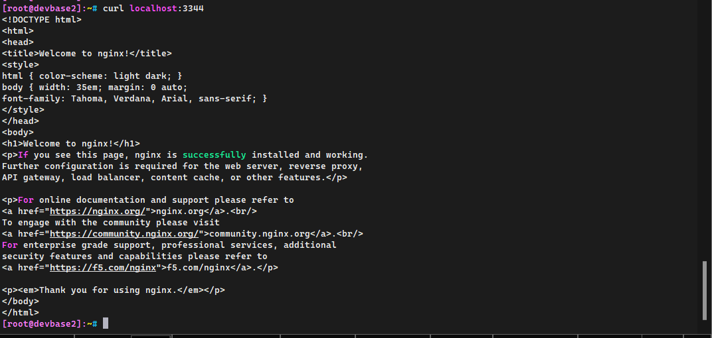

###### b) 使用公网访问

端口暴露


服务器地址

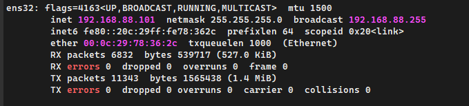

浏览器输入 192.168.88.101:3344/

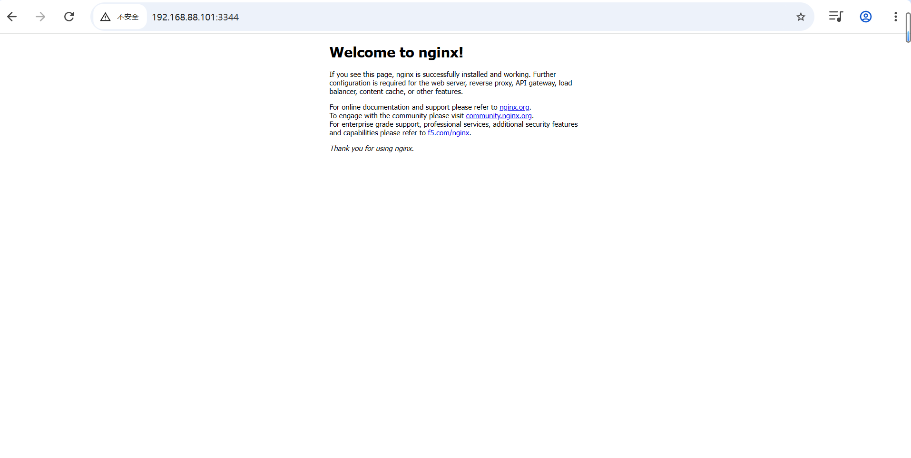

```shell
[root@devbase2]:~# docker ps
CONTAINER ID   IMAGE     COMMAND                   CREATED         STATUS         PORTS                                   NAMES
75e00c1d4537   nginx     "/docker-entrypoint.…"   6 minutes ago   Up 6 minutes   0.0.0.0:3344->80/tcp, :::3344->80/tcp   nginx01
[root@devbase2]:~#
[root@devbase2]:~# docker exec -it nginx01 /bin/bash
root@75e00c1d4537:/# whereis nginx
nginx: /usr/sbin/nginx /usr/lib/nginx /etc/nginx /usr/share/nginx
root@75e00c1d4537:/# cd /etc/nginx
root@75e00c1d4537:/etc/nginx# ls
conf.d  fastcgi_params  mime.types  modules  nginx.conf  scgi_params  uwsgi_params
root@75e00c1d4537:/etc/nginx# exit
exit
[root@devbase2]:~#
[root@devbase2]:~#  docker stop 75e00c1d4537
75e00c1d4537
[root@devbase2]:~#
[root@devbase2]:~# docker ps
CONTAINER ID   IMAGE     COMMAND   CREATED   STATUS    PORTS     NAMES
[root@devbase2]:~#

```

关闭Nginx服务后，再次刷新网页，服务关闭

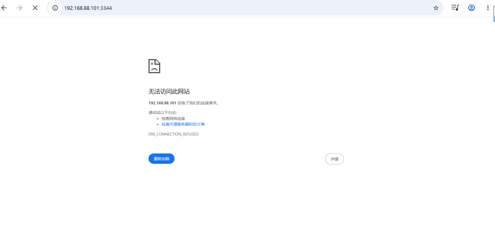

思考问题：每次改动nginx配置文件，都需要进入容器内部，十分麻烦，要是可以在容器外部提供一个映射路径，达到在容器修改文件名，容器内部就可以自动修改？-v 数据卷技术！


##### (2) 部署tomcat

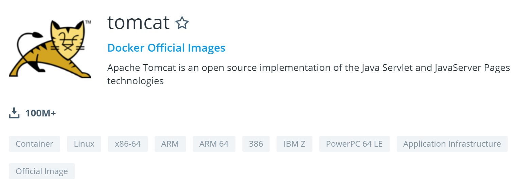

在docker hub上查看版本号和使用方法

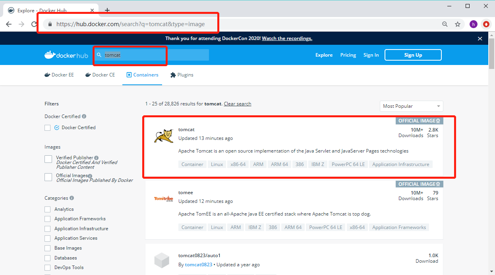


###### 官方方法

```shell
docker run -it --rm tomcat:9.0

# docker run 可以不用pull，能自动下载
# -it 直接进去运行
# 我们之前的启动都是后台，停止了容器之后，容器还是可以查到
# --rm，用完即删除，这种通常用来测试
# 冒号后跟版本号
```

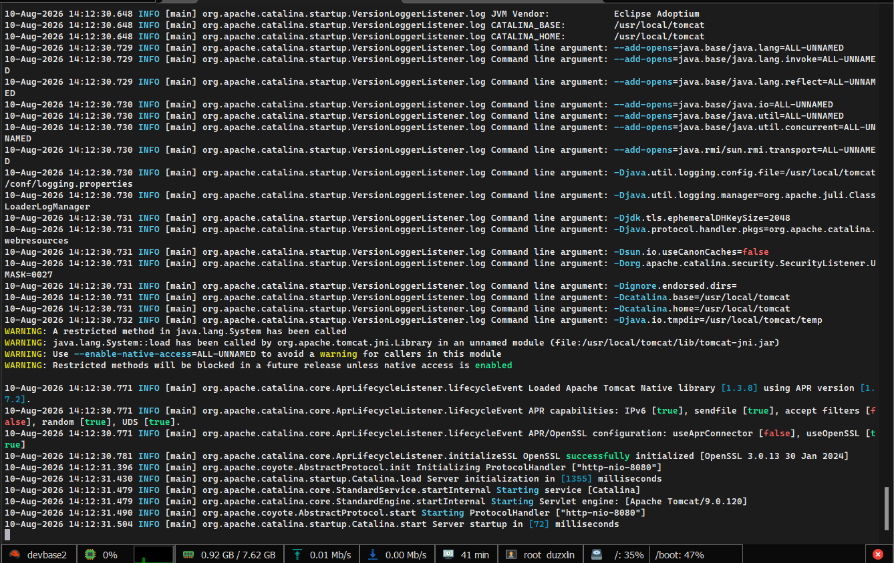

已经启动，此时`ctrl+c `退出

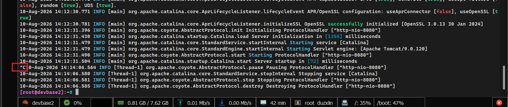

```shell
## 查看运行的容器历史，但是未看到刚刚运行的tomcat
## 这个操作印证 -rm 是阅后即焚模式，退出后容器会删除，镜像不会删除。
docker ps -a
```

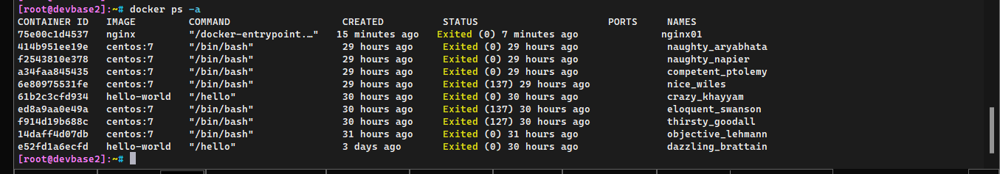


###### 正常方法

```shell
docker pull tomcat:9.0 
# 启动运行，应该加上版本号
docker run -d -p 3355:8080 --name tomcat01 tomcat:9.0 
```

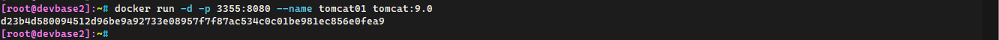

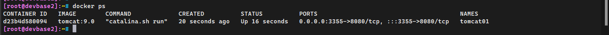

```shell
# 进入容器
docker exec -it tomcat01 /bin/bash
```

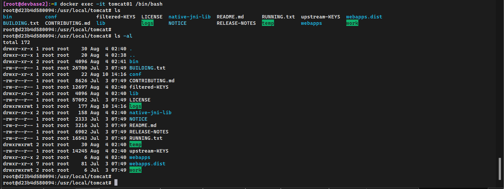

发现问题

1. linux命令少了
2. 没有webapps

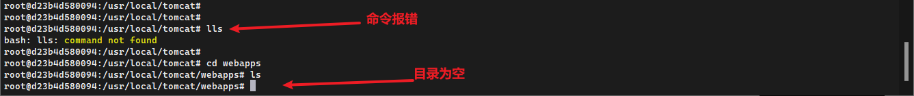

这是阿里云镜像的原因：默认使用最小镜像，所有不必要的都剔除了，保证最小可运行环境

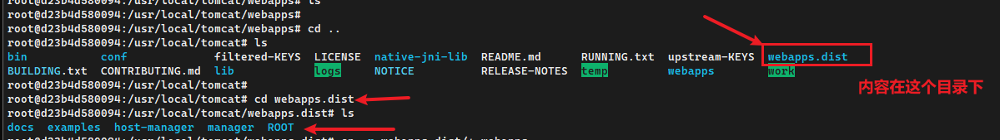

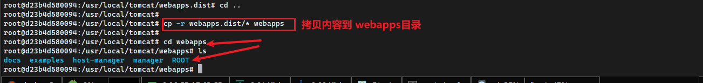

tong'gu哦浏览去访问，在浏览器中输入：http://192.168.88.101:3355/

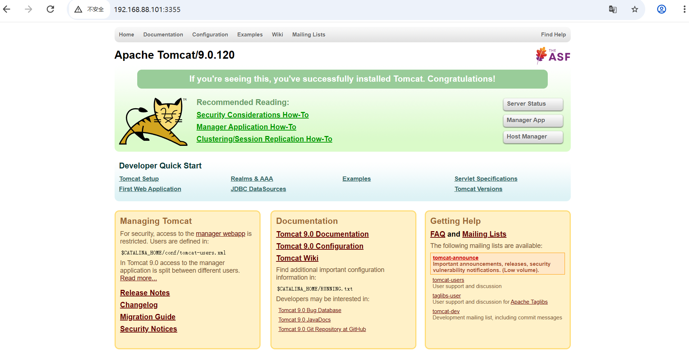


##### (3) 拉取centos7

```shell
[root@devbase2 ~]# docker pull centos:7
7: Pulling from library/centos
2d473b07cdd5: Pull complete
Digest: sha256:be65f488b7764ad3638f236b7b515b3678369a5124c47b8d32916d6487418ea4
Status: Downloaded newer image for centos:7
docker.io/library/centos:7
```

部署前面已经实践过

##### (4)拉取orcale19c

```shell
[root@devbase2 ~]# docker pull registry.cn-hangzhou.aliyuncs.com/zhuyijun/oracle:19c
19c: Pulling from zhuyijun/oracle
bce8f778fef0: Pull complete
3fc3fd32c0bc: Pull complete
02948dd6d654: Pull complete
67f2dfeb2f1b: Pull complete
2e42d8039fd9: Pull complete
b94f01bb60c6: Pull complete
Digest: sha256:3898a9394720f30ce7f0b83ef2d172f4cd11b958282e0505f83cf2b0e5eaf7d4
Status: Downloaded newer image for registry.cn-hangzhou.aliyuncs.com/zhuyijun/oracle:19c
registry.cn-hangzhou.aliyuncs.com/zhuyijun/oracle:19c
[root@devbase2 ~]#
```

部署

```shell
docker run -d \
  --name oracle19c \
  --restart=unless-stopped \
  -p 1521:1521 \
  -p 5500:5500 \
  -e ORACLE_SID=ORCLCDB \
  -e ORACLE_PDB=ORCLPDB \
  -e ORACLE_PWD=oracle \
  -e ORACLE_CHARACTERSET=AL32UTF8 \
  registry.cn-hangzhou.aliyuncs.com/zhuyijun/oracle:19c
  
 ## 进入
 docker exec -it oracle19c /bin/bash
 
 ## 切换到 Oracle 用户并设置环境变量 (重要)，有的进入容器后，直接就是oracle用户，直接可以source
 ## su - oracle
 source /home/oracle/.bash_profile
 
 
 ## 进入数据库
 sqlplus / as sysdba
```

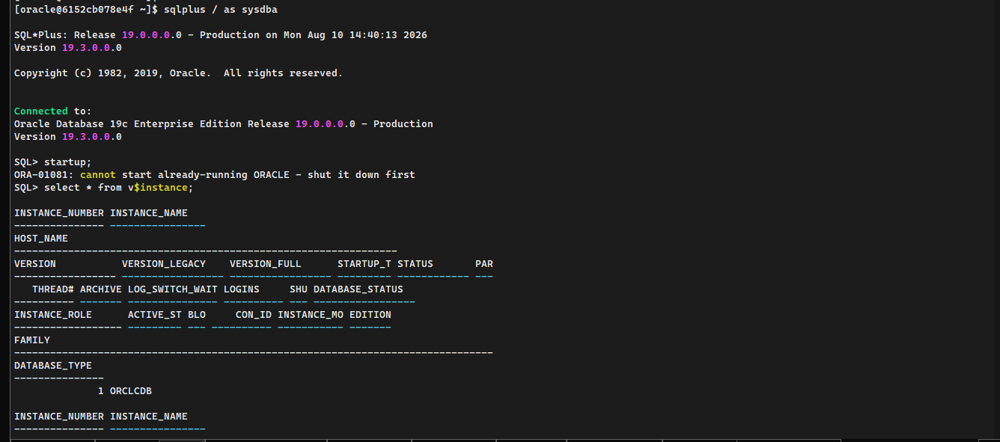


## 四、Docker镜像

**Docker 镜像**（Image）是一个**只读的、轻量级的可执行软件包**，包含了运行某个应用程序所需的一切：代码、运行时环境、系统工具、库文件和配置设置。


### 1. Docker 镜像的分层原理

Docker 镜像之所以轻量、高效，核心在于其**分层存储**与**联合挂载**的设计。

#### (1) 核心概念：镜像层 (Image Layer)

Docker 镜像并非一个单一的大文件，而是由一系列**只读的层（Layer）** 堆叠而成。在 Dockerfile 中，**每执行一条指令（如 `RUN`, `COPY`, `ADD`），就会生成一个新的层**。每一层都记录了相对于上一层发生的变化（新增、修改或删除的文件），而不是整个文件的完整副本。


#### (2) 关键技术：联合文件系统 (UnionFS)

这是实现分层原理的基石。UnionFS 能将多个独立的目录（即各个镜像层）**联合挂载**到同一个挂载点上，从外部看起来就像一个完整的文件系统。

可以这样理解：

- **底层**：是多个只读的镜像层。
- **顶层**：在容器运行时，会额外挂载一个可读写层。
- **统一视图**：UnionFS 将这所有层叠加，为容器提供一个单一、完整的文件系统视图。

Docker 在 Linux 上默认使用 **`overlay2`** 存储驱动来实现 UnionFS。


#### (3)关键机制：写时复制 (Copy-on-Write, CoW)

CoW 是分层存储能够高效运作的核心策略。

- **读取文件**：当容器需要读取一个文件时，UnionFS 会**从上到下**在各层中查找，并返回找到的第一个版本。
- **修改文件**：这是 CoW 发挥作用的关键。当容器需要修改一个存在于底层只读层的文件时，系统**不会**直接修改原文件（因为它是只读的）。相反，它会**先将该文件复制一份到容器顶层的可写层**，然后再对这个副本进行修改。

**CoW 带来的巨大优势**：

- **极致共享**：所有基于同一个镜像运行的容器，都共享底层的只读镜像层，**极大地节省了磁盘空间**。
- **启动迅速**：创建容器时无需复制整个镜像，只需在只读层上添加一个薄薄的可写层，因此容器可以在**秒级启动**。
- **镜像隔离**：每个容器都有自己的可写层，所有修改都只影响自己，互不干扰。


### 2. Docker 镜像的核心特性

- **只读性**：镜像是不可修改的。一旦构建完成，其内容就固定了。如果你要更新代码，需要重新构建一个新的镜像。
- **分层存储**：镜像是分层构建的（比如系统层 -> 运行环境层 -> 应用代码层）。每一层都依赖于上一层。
- **共享与缓存**：由于分层机制，多个不同镜像可以共享相同的基础层（比如 Ubuntu 系统层），极大节省了磁盘空间，且构建时可以复用未修改的层（缓存），速度飞快。


### 3. Docker 镜像的关键技术

#### (1) **UnionFS（联合文件系统）**

Union文件系统（UnionFS）是一种分层、轻量级并且高性能的文件系统，它支持对文件系统的修改作为一次提交来一层层的叠加，同时可以将不同目录挂载到同一个虚拟文件系统下（unit several directories into a single virtual filesystem）。Union 文件系统是 Docker 镜像的基础。镜像可以通过分层来进行继承，基于基础镜像（没有父镜像），可以制作各种具体的应用镜像。

**特性**：一次同时加载多个文件系统，但从外面看起来，只能看到一个文件系统，联合加载会把各层文件系统叠加起来，这样最终的文件系统会包含所有底层的文件和目录。

UnionFS 是一种概念，具体实现由存储引擎完成。Docker 在 Linux 上支持多种引擎：

| 存储引擎         | 特点                         | 推荐场景         |
| :--------------- | :--------------------------- | :--------------- |
| **overlay2**     | 当前默认，性能优异，稳定性高 | **生产环境首选** |
| **aufs**         | 早期引擎，已被 overlay2 替代 | 遗留系统         |
| **devicemapper** | 基于块设备，性能一般         | 不推荐           |
| **btrfs/zfs**    | 需要特定文件系统支持         | 特殊环境         |

在 Windows 上仅支持 **windowsfilter**（基于 NTFS）。

所有引擎的核心任务都是实现：

- **分层堆叠**：将多个只读层和容器可写层联合挂载
- **写时复制（CoW）**：确保修改只影响当前容器，不破坏底层镜像


#### (2) **Docker镜像加载原理**

docker的镜像实际上由一层一层的Union文件系统组成。

**bootfs(boot file system)**主要包含bootloader和kernel，bootloader主要是引导加载kernel，Linux刚启动时会加载bootfs文件系统，在Docker镜像的最底层是bootfs。这一层与我们典型的Linux/Unix系统是一样的，包含boot加载器和内核。当boot加载完成之后整个内核就都在内存中了，此时内存的使用权已由bootfs转交给内核，此时系统也会卸载bootfs。

**rootfs(root file system)**，在bootfs之上。包含的就是典型Linux系统中的/dev,/proc,/bin,/etc等标准目录和文件。rootfs就是各种不同的操作系统发行版，比如Ubuntu，Centos等等。

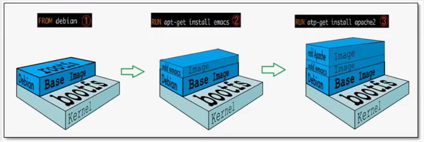

平时我们安装虚拟机的CentOS都是好几个G，为什么Docker image才200M？

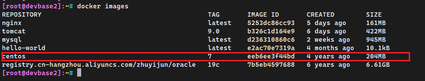

对于一个精简的OS，rootfs可以很小，只需要包含最基本的命令，工具和程序库就可以了，因为底层直接用Host的kernel，自己只需要提供rootfs就可以了。由此可见对于不同的linux发行版，bootfs基本是一致的，rootfs会有差别，因此不同的发行版可以公用bootfs。

##### bootfs 与 rootfs 的分工

- **bootfs（引导文件系统）**：包含 bootloader 和内核。Docker 镜像最底层是 bootfs，但实际运行容器时，**直接使用宿主机的内核**，因此镜像中的 bootfs 只起到占位作用，启动后会被卸载。
- **rootfs（根文件系统）**：位于 bootfs 之上，包含 `/dev`、`/proc`、`/bin`、`/etc` 等标准目录和文件。**这正是镜像体积小的原因**：Docker 镜像只打包 rootfs，不包括内核。而虚拟机镜像必须包含完整的内核和驱动，所以动辄数个 GB。

**结论**：不同 Linux 发行版（Ubuntu、CentOS 等）的 bootfs 基本一致（都是 Linux 内核），因此可以共享宿主机内核，镜像只需提供各自的 rootfs 即可。


#### (3) 分层的理解

##### 深入理解

所有的 Docker 镜像都起始于一个基础镜像层，当进行修改或增加新的内容时，就会在当前镜像层之上，创建新的镜像层。

>  层与文件的关系
>
> 每一层本质上是一个**文件变更集**（新增、修改、删除的文件）。当多层叠加时，UnionFS 将它们联合挂载，对外呈现为一个统一的文件系统视图。**如果上层存在与下层同名的文件，上层文件会完全覆盖下层文件**（即“屏蔽”效果）。

举一个简单的例子，假如基于 Ubuntu Linux 16.04 创建一个新的镜像，这就是新镜像的第一层；如果在该镜像中添加 Python 包，就会在基础镜像层之上创建第二个镜像层；如果继续添加一个安全补丁，就会创建第三个镜像层。

该镜像当前已经包含 3 个镜像层，如下图所示（这只是一个用于演示的很简单的例子）。

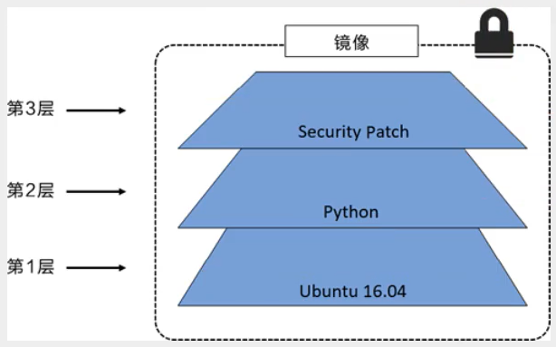

在添加额外的镜像层的同时，镜像始终保持是当前所有镜像的组合，理解这一点非常重要。下图中举了一个简单的例子，每个镜像层包含 3 个文件，而镜像包含了来自两个镜像层的 6 个文件。

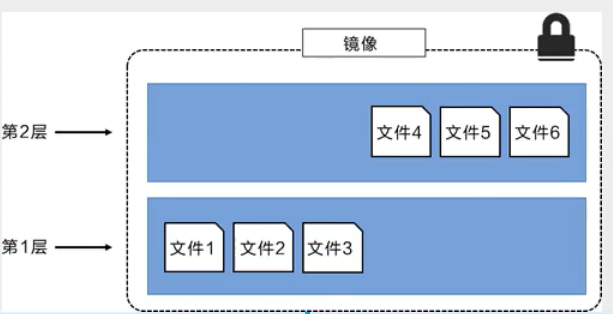

上图中的镜像层跟之前图中的略有区别，主要目的是便于展示文件。

下图中展示了一个稍微复杂的三层镜像，在外部看来整个镜像只有 6 个文件，这是因为最上层中的文件 7 是文件 5 的一个更新版本。

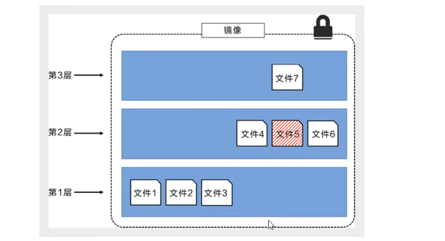

这种情况下，上层镜像层中的文件覆盖了底层镜像层中的文件。这样就使得文件的更新版本作为一个新镜像层添加到镜像当中。

Docker 通过存储引擎（新版本采用快照机制）的方式来实现镜像层堆栈，并保证多镜像层对外展示为统一的文件系统。

Linux 上可用的存储引擎有 AUFS、Overlay2、Device Mapper、Btrfs 以及 ZFS。顾名思义，每种存储引擎都基于 Linux 中对应的文件系统或者块设备技术，并且每种存储引擎都有其独有的性能特点。

Docker 在 Windows 上仅支持 windowsfilter 一种存储引擎，该引擎基于 NTFS 文件系统之上实现了分层和 CoW。

下图展示了与系统显示相同的三层镜像。所有镜像层堆叠并合并，对外提供统一的视图

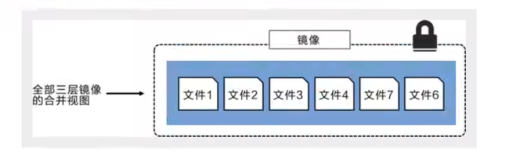


Docker镜像都是只读的，当容器启动时，一个新的可写层被加到镜像的顶部，这一层就是我们通常说的容器层，容器层之下的都叫镜像层

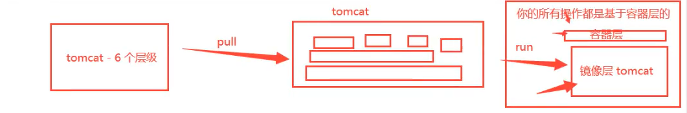


##### **思考：为什么Docker镜像要采用这种分层的结构呢？**

最大的好处，我觉得莫过于是资源共享了！比如有多个镜像都从相同的Base镜像构建而来，那么宿主机只需在磁盘上保留一份base镜像，同时内存中也只需要加载一份base镜像，这样就可以为所有的容器服务了，而且镜像的每一层都可以被共享。

> - **磁盘共享**：多个基于相同基础镜像（如 `ubuntu:20.04`）构建的镜像，只需在磁盘上保存一份基础层。所有镜像共享这些只读层，大幅节省存储空间。
> - **内存共享**：当多个容器运行时，它们也共享内存中加载的同一份基础镜像层，降低内存开销。
> - **构建缓存**：分层使得构建过程可以缓存未变更的层，每次构建只需重新构建变化层，极大提速


##### 实际验证：如何查看镜像分层？

下载一个镜像，注意观察下载的日志输出，可以看到是一层一层的在下载！

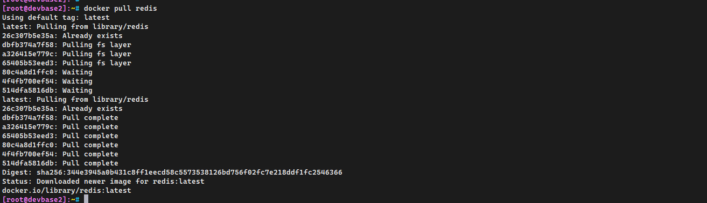

查看镜像分层的方式可以通过`docker image inspect`命令

```shell
# 查看 redis 镜像的分层
docker image inspect redis:latest

# 输出中会包含 "RootFS" 字段，其中 "Layers" 列表显示每一层的 SHA256 哈希值
```

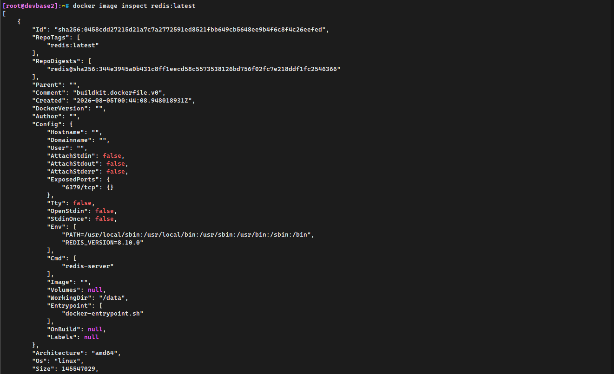

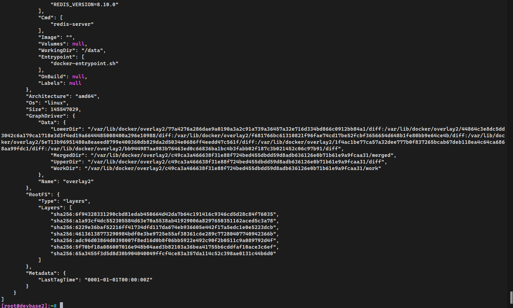

此外，还可以使用 `docker history` 查看镜像构建历史，更直观地看到每一层对应的 Dockerfile 指令：

```shell
docker history redis:latest
```

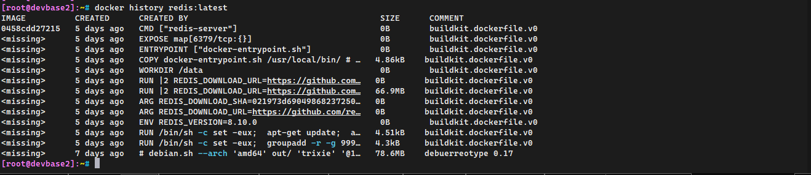


### 4. 总结要点

> 1. **镜像 = 只读层堆叠**；**容器 = 镜像 + 可写层**。
> 2. **分层共享** → 省空间、省内存、加速构建。
> 3. **rootfs 不含内核** → 镜像体积小（几百 MB vs 虚拟机数 GB）。
> 4. **上层文件覆盖下层** → 实现版本更新。
> 5. **存储引擎**（如 overlay2）负责联合挂载和写时复制。
> 6. **验证分层**：`docker image inspect` 和 `docker history`。


### 5. `commit `提交镜像

`docker commit` 提交容器成为一个新的副本

```shell
## 命令和git原理类似
docker commit -m="提交的描述信息" -a="作者" [容器id] 目标镜像名:[TAG]


补充说明
docker commit 命令用于将容器的当前状态（包括所有文件系统修改）保存为一个新的镜像。它的典型使用场景是：

临时调试：在容器中手动安装软件、修改配置后，保存为镜像供后续使用

快速原型：快速保存实验性环境，而不必编写 Dockerfile
```


实战测试
1、启动一个默认的tomcat

```shell
# 启动运行，应该加上版本号
docker run -d -p 3355:8080 --name tomcatbase tomcat:9.0 
```

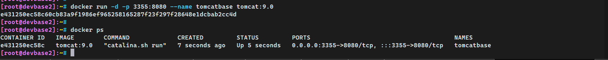


2、进入容器（另开一个SESS进入），发现这个默认的tomcat 是没有webapps应用，镜像的原因，官方的镜像默认 webapps下面是没有文件的！

```shell
# 进入容器
docker exec -it tomcatbase /bin/bash
```

发现问题

1. linux命令少了
2. 没有webapps

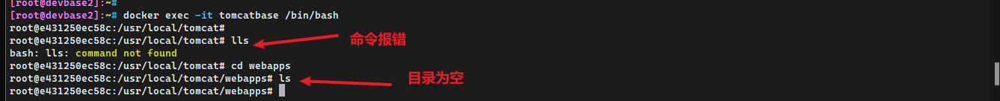

这是阿里云镜像的原因：默认使用最小镜像，所有不必要的都剔除了，保证最小可运行环境

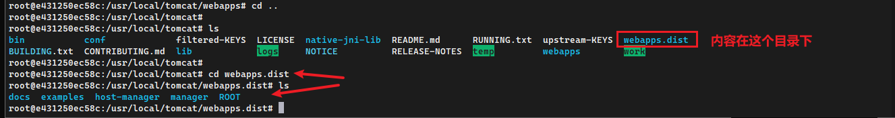


3、自己拷贝进去基本的文件

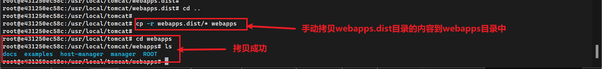


4、将操作过的容器通过commit提交为一个镜像！我们以后就使用我们修改过的镜像即可，这就是我们自己的一个修改的镜像

```shell
docker commit -a="duzxlin" -m="add webapps app" e431250ec58c mytomcat:1.0
```

此时发现，自己打包的tomca体积比官方提供的体积大。这是由于我们在官方的保本上做了一些操作（第三步的拷贝基础文件），记录了手动的操作，因此打包后体积会大一些。

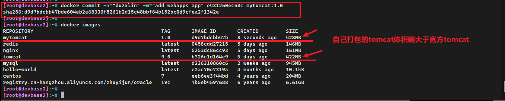


通过浏览去访问，在浏览器中输入：http://192.168.88.101:3355/


## 五、Docker 数据管理

### 1 容器数据卷（Volume）

docker是要将应用和环境打包成一个镜像，但数据不应该直接存储在容器中，否则容器删除，数据就会丢失。因此，容器之间要有一个数据共享技术。在Docker容器中产生的数据，同步到本地，这就是卷（Volume）技术。

数据卷是 Docker 容器的**持久化数据存储区**，独立于容器的生命周期——即使容器被删除，卷中的数据仍然存在。

本质上是一个目录挂载，将容器内的目录挂载到虚拟机上

目的：容器的持久化和同步操作，容器间可以数据共享

**三种存储方式**：

| 方式                       | 说明                    | 适用场景           |
| :------------------------- | :---------------------- | :----------------- |
| **Volume（数据卷）**       | Docker 管理的持久化存储 | 推荐，生产环境首选 |
| **Bind Mount（绑定挂载）** | 直接映射主机目录        | 开发环境热更新     |
| **tmpfs mounts**           | 内存文件系统            | 临时数据           |


#### 方式一：绑定挂载（Bind Mount）

最直接的方式，将宿主机上的特定文件或目录映射到容器内部。
**使用场景**：开发环境热更新、代码实时同步、向容器注入配置文件。

- **特点**：
  - ✅ 宿主机和容器文件双向实时同步。
  - ❌ 路径依赖宿主机结构，不可移植（Dockerfile 中无法定义）。
  - ⚠️ 若宿主机路径不存在，Docker 会自动创建空目录（但生产环境需谨慎）。

```shell
# 通过命令绑定挂载容器数据卷
docker run -it -v 主机目录:容器目录 镜像名
# -it 交互式进入
# -v 挂载卷。将宿主机目录/文件挂载到容器内部，或将命名卷挂载到容器内部。这是 Docker 中数据持久化和共享的关键机制。

## 在挂载路径末尾可以追加 :ro 或 :rw（默认是 rw 读写）
# :ro 容器内对该目录只读，无法修改。适合挂载配置文件（容器只读，宿主机改配置后重启容器生效）。
# :rw 容器内对该目录可读写
```

##### demo01

```shell
## 1、sess1 中启动一个centos容器，并将home目录映射到宿主机的 /data/docker_volumedata/目录下
docker run -it -v /data/docker_volumedata/:/home centos:7 /bin/bash

## 2、sess2 中查看容器的详细信息，找到挂载信息Mounts
docker inspect 

## 使用-v技术后，数据是双向同步的！！
## 3、在容器/home中增加文件 test01.c，查看宿主机的/data/docker_volumedata 中存在test01.c
## 4、在宿主机的/data/docker_volumedata 中增加文件 test02.c，查看容器/home中存在test02.c
## 5、容器停止后，修改宿主机文件，再启动容器的时候，文件同样改变
```

###### 步骤1

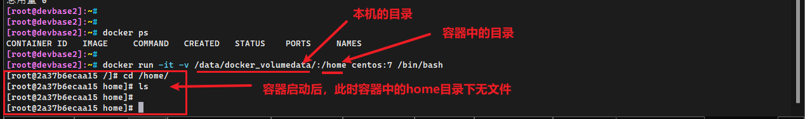

###### 步骤2

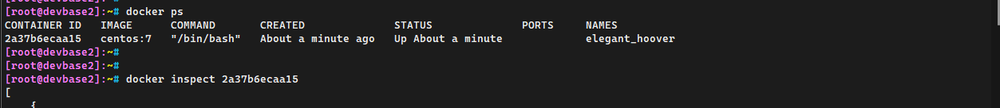

找到挂载信息Mounts

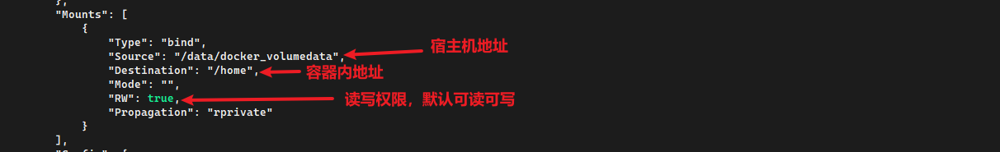

###### 步骤3&4

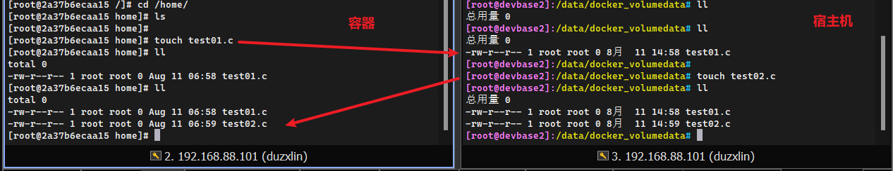

###### 步骤5

容器停止后，修改主机文件，再启动容器的时候，数据同样改变

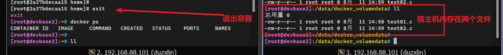

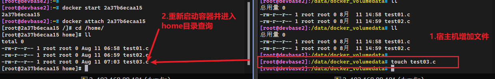


#### 方式二： 命名卷（Named Volume）/ 具名挂载

由 Docker 管理的存储空间，数据存储在 Docker 的专属目录下（如 Linux 的 `/var/lib/docker/volumes/`，Windows 的 `C:\ProgramData\Docker\volumes\`）。
**使用场景**：生产环境数据持久化（数据库）、容器间共享数据、需要备份/迁移的数据。

- **语法**：`-v 卷名:/容器路径`

  ```shell
  docker run [...] -v 卷名:/容器路径 REPOSITORY:TAG
  ```

- **特点**：

  - ✅ 不依赖宿主机路径，跨环境可移植。
  - ✅ 数据卷可被多个容器同时挂载（通过 `--volumes-from`）。
  - ✅ 支持数据卷驱动（如 NFS、云存储）。
  - 💡 可通过 `docker volume ls` 查看，用 `docker volume inspect` 查看详情。

##### demo02

```shell
# 命名卷挂载（通过 -v 卷名:容器内路径，可以手动指定卷的名称）
[root@devbase2]:~# docker run -d -P --name nginx01 -v Named-nginx:/etc/nginx nginx
942ecc09b437028050ef2507975566fa6db6e6c3d3cc80e3628ce2859aafcbaa
[root@devbase2]:~#

# 查看一下这个卷
[root@devbase2]:~# docker volume ls
DRIVER    VOLUME NAME
local     Named-nginx

# 查看卷的详细信息
[root@devbase2]:~# docker volume inspect Named-nginx
[
    {
        "CreatedAt": "2026-08-11T15:49:11+08:00",
        "Driver": "local",
        "Labels": null,
        "Mountpoint": "/var/lib/docker/volumes/Named-nginx/_data",
        "Name": "Named-nginx",
        "Options": null,
        "Scope": "local"
    }
]
[root@devbase2]:~#

```

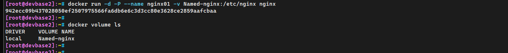

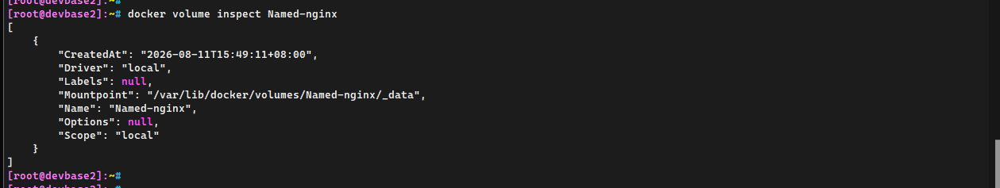

#### 方式三： 匿名卷（Anonymous Volume）/ 匿名挂载

不指定卷名，由 Docker 自动生成一个随机名称。
**使用场景**：临时或辅助存储（如日志、缓存），通常配合 Dockerfile 中的 `VOLUME` 指令使用。

- **语法**：`-v /容器路径`

  ```shell
  docker run -v /app/logs ngin
  ```

- **特点**：

  - ⚠️ 不易管理（卷名随机），容器删除后卷可能残留。
  - 🧹 可用 `docker volume prune` 清理未使用的匿名卷。

##### demo03

```shell
# 匿名挂载
[root@devbase2]:~# docker run -d -P --name nginx02 -v /ect/nginx nginx
8dcba183391f309a2027c0de26a2b74f3fc48efa74dc873daae2a251af57433b

# 查看所有的 volume 的情况
[root@devbase2]:~# docker volume ls
DRIVER    VOLUME NAME
local     8363ec8cd51db76618e52a81450d1b4383d67e322138587629d339e067221049
local     Named-nginx
[root@devbase2]:~#

# 这里发现，匿名挂载时，只在 -v 写容器内的路径，没有写容器外的路径！
```

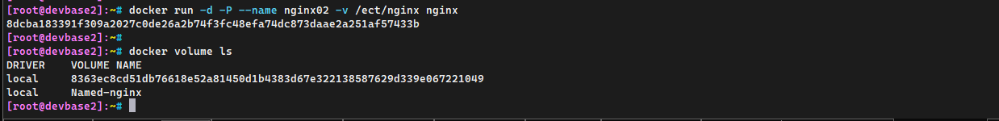


#### 🔍 区分上述三种挂在方法

##### ① 看 `-v` 的第一个字段）

| 挂载类型             | `-v` 语法格式                | 第一个字段特征                            | 示例                       |
| :------------------- | :--------------------------- | :---------------------------------------- | :------------------------- |
| **Bind Mount**       | `-v 宿主机绝对路径:容器路径` | **以 `/` 或盘符开头**（如 `/d/`、`C:`）   | `-v /d/myapp:/app`         |
| **Named Volume**     | `-v 卷名:容器路径`           | **纯字母/数字/下划线组合，不以 `/` 开头** | `-v mydata:/var/lib/mysql` |
| **Anonymous Volume** | `-v 容器路径`                | **仅容器路径，无宿主机路径或卷名**        | `-v /app/logs`             |

##### ② `docker inspect` 查看挂载详情

**输出解读**：

| 挂载类型             | `Type` 字段 | `Source` 字段                                                | `Name` 字段            |
| :------------------- | :---------- | :----------------------------------------------------------- | :--------------------- |
| **Bind Mount**       | `bind`      | 宿主机绝对路径（如 `/d/host_data`）                          | 空（或 `""`）          |
| **Named Volume**     | `volume`    | Docker 卷存储位置（如 `/var/lib/docker/volumes/my_volume/_data`） | 卷名（如 `my_volume`） |
| **Anonymous Volume** | `volume`    | Docker 卷存储位置（如 `/var/lib/docker/volumes/2c3e4f.../_data`） | 随机哈希（匿名）       |

#### 🔍拓展

```shell
# 通过 -v 容器内路径：ro  rw 改变读写权限
ro    readonly  # 只读，能通过宿主机来操作，容器内部是无法操作
rw    readwrite  # 可读可写

# 一旦设置了容器权限，容器对我们挂载出来的内容就有限定
docker run -d -P --name nginx02 -v juming-nginx:/etc/nginx:ro nginx
docker run -d -P --name nginx02 -v juming-nginx:/etc/nginx:rw nginx

```


#### exercise1：MySQL的数据持久化

使用容器卷技术，在docker中部署mysql数据库并实现数据持久化。

```shell
## 在docker中部署mysql,使用-v指定数据卷
## 可以使用多个-V可以不同的数据卷挂载
## /data/docker_volumedata/mysql_exercise1/conf 挂载容器中mysql的conf配置文件
## /data/docker_volumedata/mysql_exercise1/data 挂载容器中mysql的数据目录
docker run -d -p 3310:3306 -v /data/docker_volumedata/mysql_exercise1/conf:/etc/mysql/conf.d -v /data/docker_volumedata/mysql_exercise1/data:/var/lib/mysql -e MYSQL_ROOT_PASSWORD=123456 --name mysql01 mysql

## 参数解释
-d 后台运行
-p 端口映射
-v 卷挂载
-e 环境配置 安装启动mysql需要配置密码
--name 容器名字
```

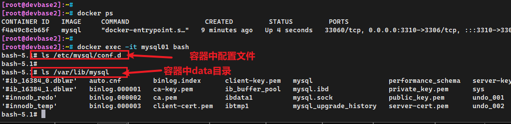

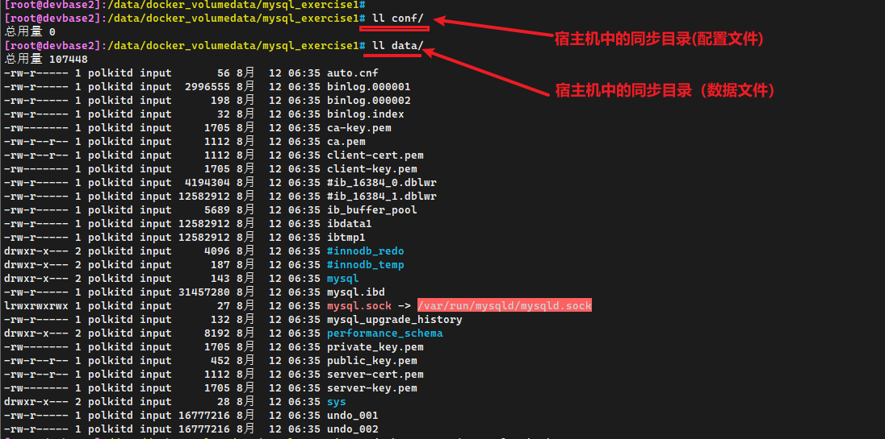

使用dbeaver连接数据库，连接OK

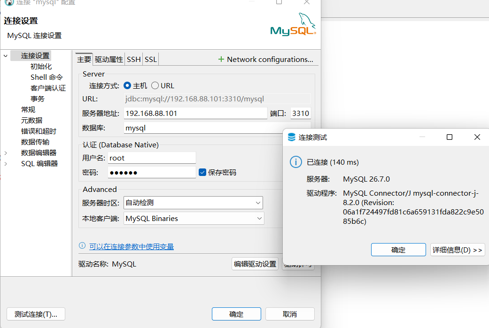

需要注意:MySQL 8.0 默认使用 `caching_sha2_password` 作为身份验证插件，而较旧的 JDBC 驱动（如 MySQL Connector/J 8.0.16 之前）在建立连接时，默认不允许从服务器获取公钥（为了安全考虑），导致连接失败。在DBaver中需要进行配置。

 DBeaver 的“驱动属性”标签页中，设置如下属性

| 属性名                    | 值      |
| :------------------------ | :------ |
| `allowPublicKeyRetrieval` | `true`  |
| `useSSL`                  | `false` |

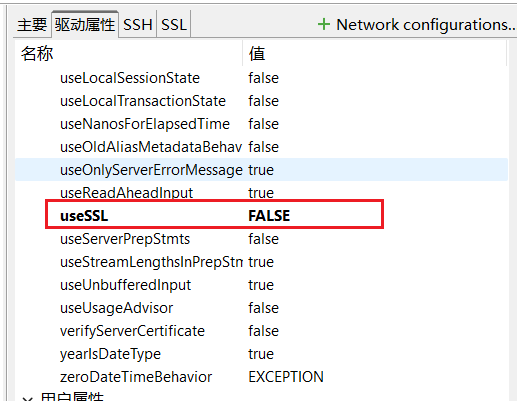

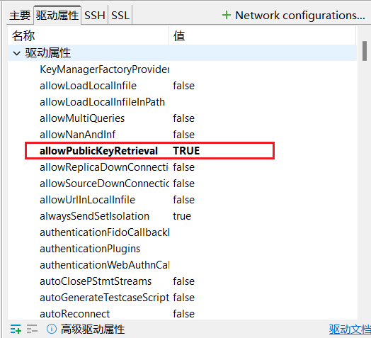


#### exercise2：使用dockerfile构建个人镜像，并指定共享数据卷

使用Dockerfile技术，构建docker镜像的文件

##### (1) 在宿主机中生成一个Dockerfile文件

Dockerfile文件中指令都是大写的，这里的每个命令可以理解为镜像的一层，VOLUME 含义是在创建镜像的时候就挂载出来

`/data/docker_volumedata/centos_exercise/dockerfile1`

```shell
FROM centos:7

VOLUME ["volume01","volume02"] 

CMD echo "---end---"
CMD /bin/bash
```

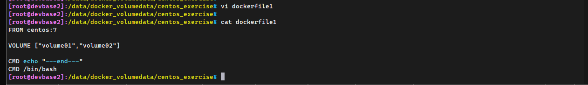

##### (2) 在docker中使用build部署

将**当前目录**下的文件作为构建环境，使用名为 **`dockerfile1`** 的构建配置文件，构建出一个命名为 `duzxlin/centos:1.0`*的 Docker 镜像

```shell
## 注意：最后的点很重要 镜像名不能有/
docker build -f dockerfile1 -t duzxlin/centos:1.0 .  

## -f 指定了一个自定义文件名 dockerfile1
## -t 代表 --tag。完整的镜像名由三部分组成：
- 仓库/用户名：duzxlin（通常对应 Docker Hub 的用户名或仓库名）
- 镜像名：centos
- 标签：1.0（表示版本号，如果不写默认是 latest）
## 最后的 . 表示是在当前目录下进行构建。这个 . 表示 当前目录 会被作为“构建上下文”打包发送给 Docker 守护进程。Dockerfile 中的 COPY 或 ADD 指令只能访问这个上下文路径下的文件。
```

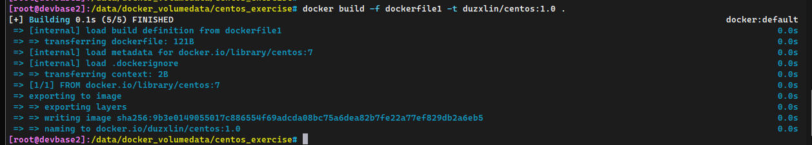

##### (3) 查看生成的镜像

```shell
docker images
```

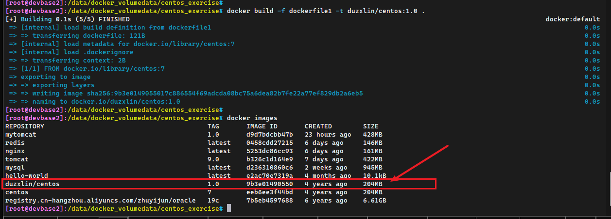


##### (4) 启动生成的镜像

```shell
docker run -it 9b3e01490550 /bin/bash
```

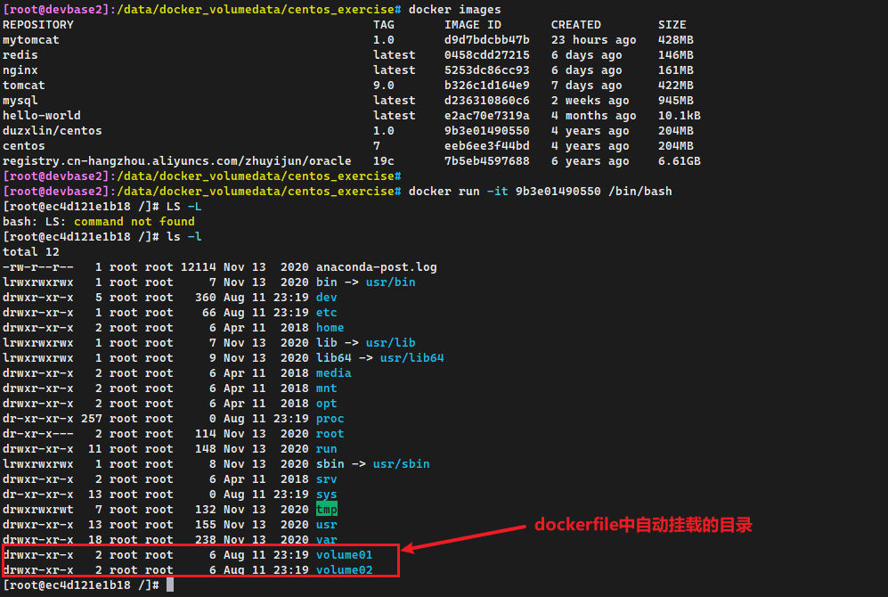

##### (5) 测试容器卷挂载信息

查看Mounts，Source对应容器外目录，本次挂载使用的是匿名挂载方式

```shell
## 查看使用自己的image运行的容器
docker ps 
## 查看容器中的详细信息，关注mounts中的挂载目录
docker imspect ec4d121e1b18
```

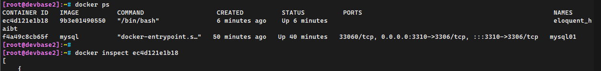

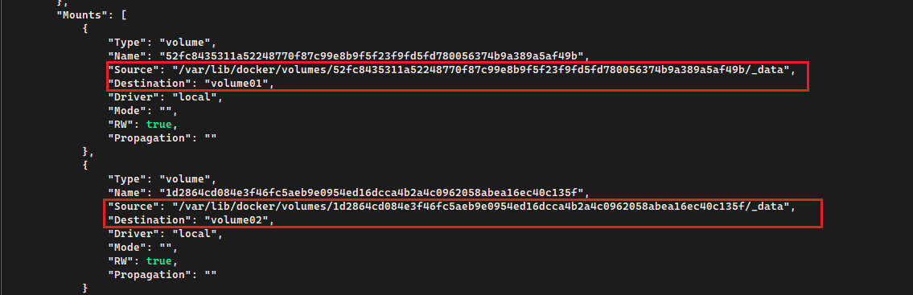

##### (6) 测试是否共享

在container volume01下生成文件，在主机挂载路径下，也同样生成

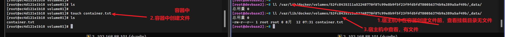


#### exercise3：多个容器中的数据共享

通过` --volumes-from `可以实现多个不同容器间的数据共享

##### 结论：

1、容器之间配置信息的传递，数据卷容器的生命周期一直持续到没有容器使用位置

2、但是如果持久化到了本地，即使所有容器删除了，本地数据是不会删除的

##### (1) 使用exercise2中生成的个人image,部署3个容器

```shell
docker images
## 启动docker01，用之前建的padaxing/centos 1.0 镜像
docker run -d -it --name docker01 duzxlin/centos:1.0 
docker run -d -it --name docker02 --volumes-from docker01 duzxlin/centos:1.0
docker run -d -it --name docker03 --volumes-from docker01 duzxlin/centos:1.0

## 依次登录三个容器，验证三个容器中的挂载卷中均无内容
docker exec -it docker01 /bin/bash
docker exec -it docker02 /bin/bash
docker exec -it docker03 /bin/bash
```

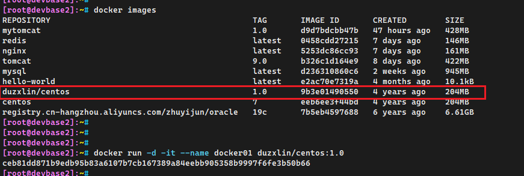

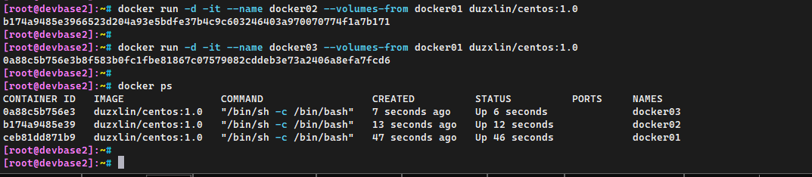

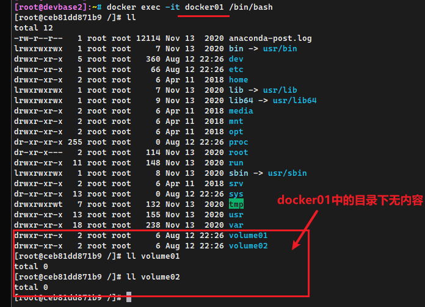

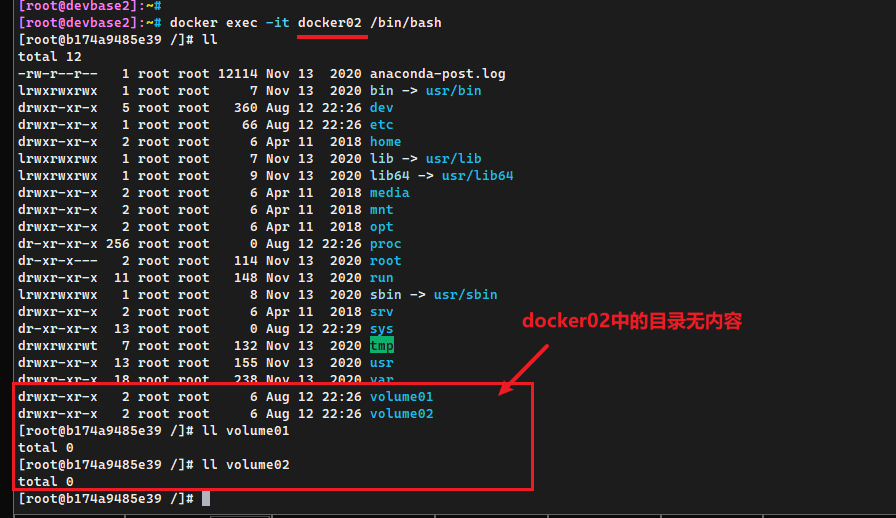

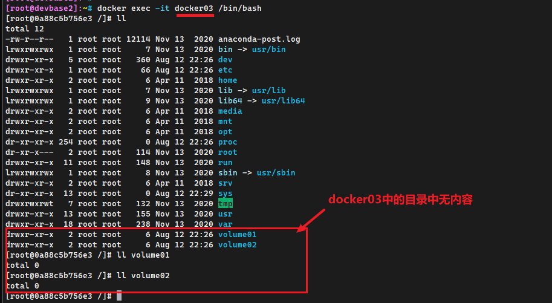

##### (2) docker02继承docker01的volumes

验证，在docker01下加一个数据，在docker02下也会出现

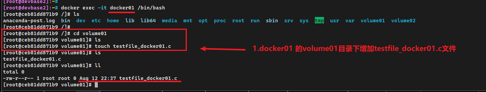

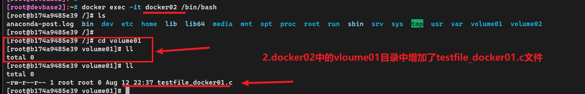

##### (3) docker03也继承docker01的volumes

验证，在docker03的`volume01`下建立文件，在docker02/docker01的`volume01`下同样也有

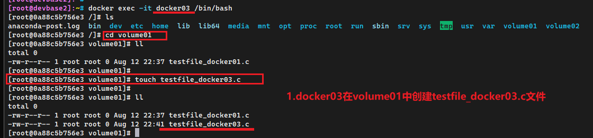

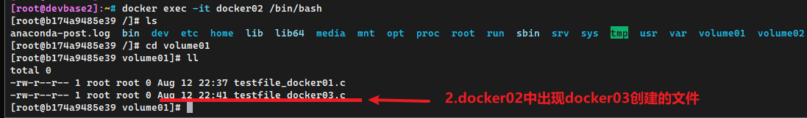

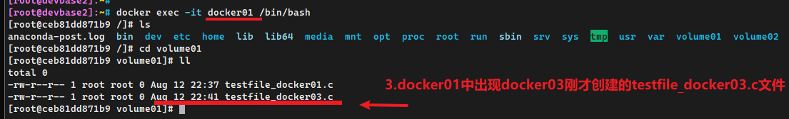

##### (4) 查看宿主机和 docker01/docker01/docker03  的数据卷信息

验证，宿主机中挂载 docker01/docker01/docker03  的数据卷volume01中都有`testfile_docker01.c`,`testfile_docker03.c`

###### 查看docker01/docker01/docker03 的挂载卷信息

**结论**： 由于三个容器共享`volume01`的挂载卷，因此三个容器的挂载卷映射在主机中都是同一个卷，且内容一致

```shell
docker inspect docker01
docker inspect docker02
docker inspect docker03
```

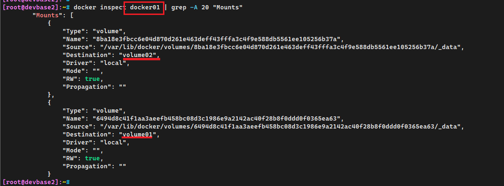

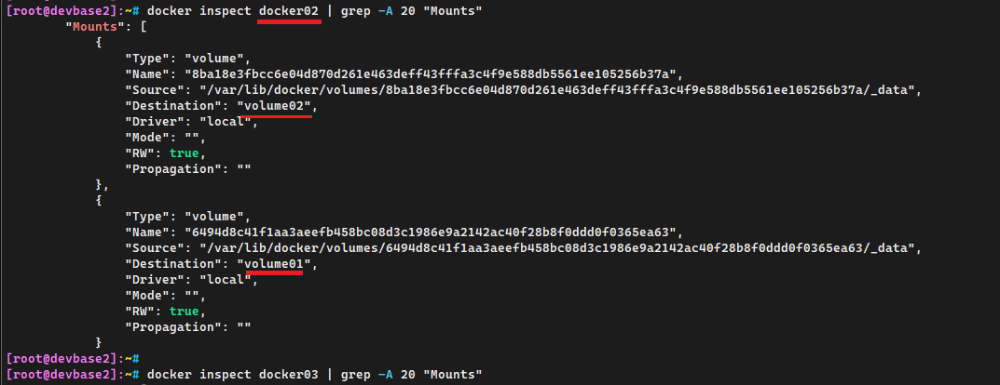

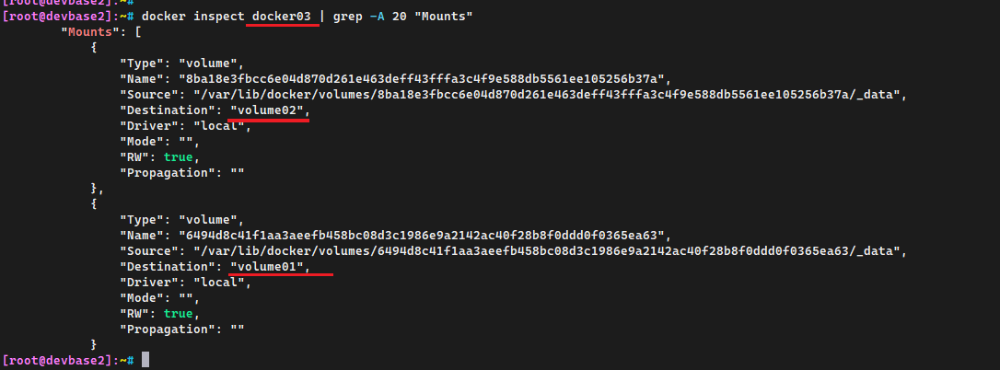

###### 查看宿主机中的挂载卷内容

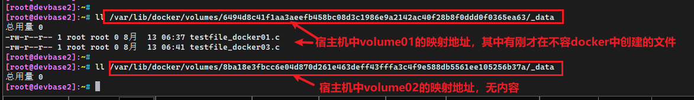

##### (5) 删除docker01，保留docker02，docker03

验证，此时，`volume01/volum02`中的数据依然存在

```shell
## 删除docker01 
docker rm -f docker01

## 分别登录docker02/docker03 查看volume01中的数据是否还存在
dcoker exec -it docker02 /bin/bash
dcoker exec -it docker03 /bin/bash
```

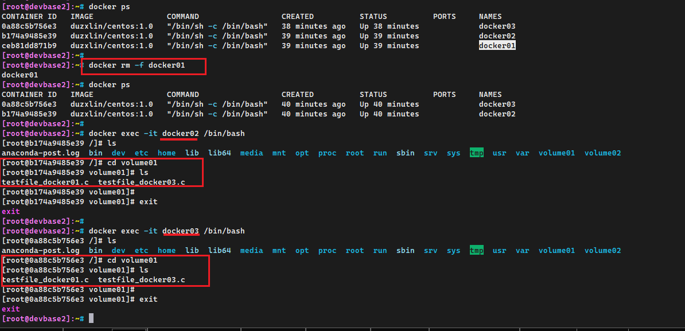

##### (6) 删除docker02，保留docker03

验证，此时，`volume01/volum02`中的数据依然存在

```shell
## 删除docker01 
docker rm -f docker02

## 登录docker03 查看volume01中的数据是否还存在
dcoker exec -it docker03 /bin/bash
```

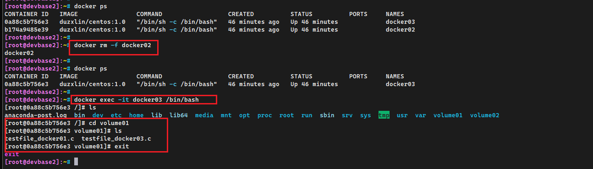

##### (7) 删除docker03

验证，此时，容器中`volume01/volum02`中的数据无了，但由于之前已经同步到了本地，因此本地数据依然存在

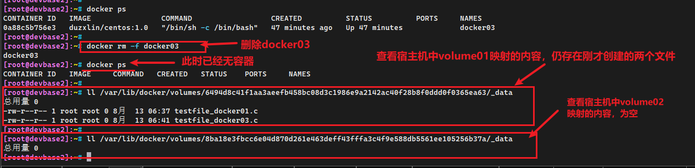


### (2) DockerFile

Dockerfile 是构建 Docker 镜像的蓝图，定义了镜像的构建过程。可以理解为makefile，是关于docker如何构建的脚本

构建步骤：

1. 编写一个dockerfile文件
2. docker build 构建成为一个镜像
3. docker run运行镜像
4. docker push 发布镜像（DockerHub、阿里云镜像仓库 私有/共有）


#### (1) 官方DockerFile示例

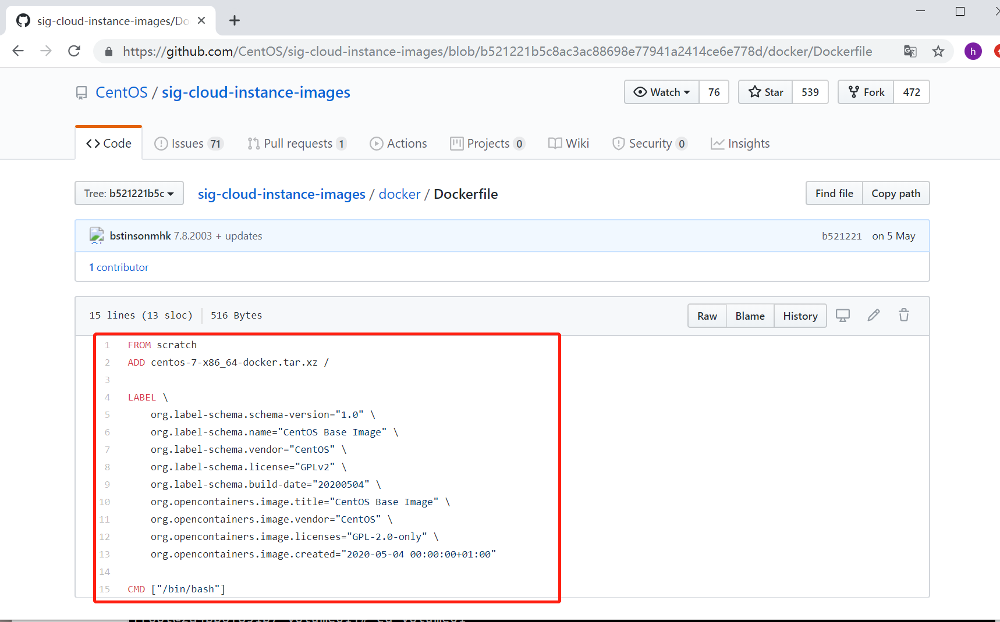

可以看到官方镜像都是基础包，很多功能没有，因此在通过dockerfile编写自己的镜像是，通常会自己搭建所需要的功能


#### (2) DockerFile基础知识

1. Dockerfile **必须以 `FROM` 指令开头**,之前只能有解析器指令、注释和全局范围的 `ARG`
2. 每个指令都必须是大写字母
3. Docker 按从上到下顺序执行 Dockerfile 中的指令
4. *#*表示注释
5. 每一个指令都会创建体检一个新的镜像层，并提交

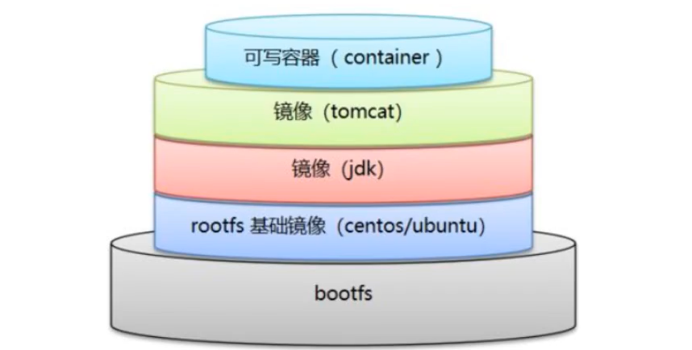

补充：解析器指令是可选的，影响 Dockerfile 后续行的处理方式，以 `# directive=value` 形式编写，必须位于 Dockerfile 顶部。

`syntax` 解析器指令指定用于构建 Dockerfile 的语法版本。例如：

```dockerfile
# syntax=docker/dockerfile:1
FROM ubuntu:22.04
```


#### (3) DockerFile命令

| 指令                     | 作用说明                                          | 通俗理解                                                     |
| :----------------------- | :------------------------------------------------ | :----------------------------------------------------------- |
| **FROM**                 | 指定基础镜像，是 Dockerfile 的第一条有效指令      | 所有镜像都源自某个基础镜像，它就是“妈妈”。                   |
| **MAINTAINER**（已弃用） | 指定维护者信息（邮箱或姓名）                      | 出了事找谁？留个联系方式。推荐改用 `LABEL maintainer=...`。  |
| **LABEL**                | 为镜像添加键值对元数据（版本、描述、维护者等）    | 写上版本号、作者、用途，方便管理和筛选。                     |
| **RUN**                  | 在**构建时**执行命令，用于安装软件包、编译等      | **“你想让它干啥，就在命令前面加上 RUN”** — 比如 `RUN yum install nginx`。 |
| **COPY**                 | 将文件/目录从构建上下文复制到镜像中               | **“低级搬运工”** — 只复制，不解压，不下载，纯粹的文件搬运工。 |
| **ADD**                  | 增强版 COPY，支持远程 URL 下载和自动解压 tar 文件 | **“高级搬运工”** — 除了复制，还能从网上下载、自动解压缩包。  |
| **WORKDIR**              | 设置后续命令的工作目录（类似 `cd`）               | 指定当前工作路径，是镜像的工作目录，后续命令都在这里执行。   |
| **VOLUME**               | 创建挂载点，用于持久化或共享数据                  | 挂载的目录。容器里的数据放这里，即使容器删除，数据还在宿主机上。 |
| **EXPOSE**               | 声明容器运行时监听的端口（仅文档作用）            | **“它要打开的门是啥”** — 告诉用户容器用了哪个端口，但实际映射还需要 `-p`。 |
| **ENV**                  | 设置环境变量（构建时和运行时都有效）              | **“设置全局参数”** — 比如数据库密码、应用模式，容器里随时能读取。 |
| **ARG**                  | 定义构建时变量（仅在构建过程中有效）              | **“构建时的临时变量”** — 像 `--build-arg VERSION=1.0`，用于灵活定制版本。 |
| **USER**                 | 切换执行后续命令的用户（非 root 更安全）          | **“换个身份干活”** — 用普通用户而非管理员运行程序，防止误删系统文件。 |
| **CMD**                  | 指定容器启动时默认执行的命令（可被覆盖）          | 指定这个容器启动的时候要运行的命令，只有最后一个会生效，而且可被替代 |
| **ENTRYPOINT**           | 指定容器启动时**必须执行**的命令（不可被覆盖）    | 指定这个容器启动的时候要运行的命令，可以追加命令<br />— 容器启动必执行，`CMD` 只是它的参数，比如 `ENTRYPOINT ["nginx"]` + `CMD ["-g","daemon off;"]`。 |
| **HEALTHCHECK**          | 定义周期性健康检查命令，检测容器状态              | **“定时体检”** — 每隔几秒检查服务是否还活着，挂了就自动重启或告警。 |
| **SHELL**                | 更改默认的 Shell（默认是 `/bin/sh -c`）           | **“换个命令行解释器”** — 默认用 sh，你可以改成 bash 或 zsh。 |
| **STOPSIGNAL**           | 设置发送给容器退出的系统信号（默认 SIGTERM）      | **“告诉容器怎么优雅退出”** — 比如换成 SIGQUIT，让进程有清理机会。 |
| **ONBUILD**              | 当该镜像被其他 Dockerfile `FROM` 时触发的指令     | **“延迟执行的祖传秘方”** — 现在不执行，等儿子镜像构建时才执行，适合做基础框架。 |

```dockerfile
##AS <name>：为构建阶段命名，用于多阶段构建
## 一个 Dockerfile 可以有多个 FROM 用于多阶段构建
FROM <image>[:<tag>] [AS <name>]
FROM ubuntu:22.04
FROM python:3.9-alpine AS builder
FROM nginx:1.23

## 在镜像构建过程中执行命令，每条 RUN 都会创建一个新的镜像层。
## RUN两种格式：
## 1、Shell 格式：
RUN <command>（默认使用 /bin/sh -c）
RUN yum -y install wget
# 合并多条命令，减少镜像层数
RUN yum -y install gcc make && \
    yum clean all && \
    rm -rf /var/cache/yum
## 2、Exec 格式： 
RUN ["executable", "param1", "param2"]
RUN ["yum", "-y", "install", "wget"]


## COPY — 复制文件，将文件或目录从构建上下文复制到镜像中。保留文件元数据（权限等）
COPY <src> <dest>
## <src> 必须是相对于 Dockerfile 所在目录的路径
## <dest> 可以是绝对路径或相对于 WORKDIR 的路径
COPY . /app
COPY package.json /app/
COPY --from=builder /app/dist /app/dist   # 多阶段构建中从其他阶段复制

## 类似于 COPY，但额外支持：
## 1)远程 URL 作为源
## 2)自动解压 tar 文件
ADD https://example.com/file.tar.gz /tmp/
ADD app.tar.gz /app/


## 设置后续指令（RUN、CMD、ENTRYPOINT、COPY、ADD）的工作目录。
## 如果目录不存在会自动创建
## 建议使用绝对路径，避免使用 RUN cd
## 可多次使用，路径支持相对路径（相对于上一个 WORKDIR）
WORKDIR /app
WORKDIR src        # 实际为 /app/src
WORKDIR /var/log   # 切换到绝对路径


## 设置环境变量，构建期间和容器运行时均可用。
##  ENV <key>=<value>
## 后续指令可通过 $变量名 引用。
ENV APP_HOME=/app
ENV NODE_VERSION=18.17.0
ENV PATH=$PATH:$APP_HOME/bin


## ARG — 构建时变量 ：定义仅在构建过程中有效的变量。
## ARG <变量名>[=<默认值>]
ARG NODE_VERSION=20
ARG ALPINE_VERSION=3.21
FROM node:${NODE_VERSION}-alpine${ALPINE_VERSION}

## 构建时可通过 --build-arg 覆盖：
docker build --build-arg NODE_VERSION=18 -t myapp .
## 区别 ARG vs ENV：ARG 仅构建时有效，ENV 构建和运行时均有效。


## EXPOSE — 声明端口
## 声明容器运行时监听的端口（仅文档作用，不实际映射端口）。
EXPOSE <port> [<port>/<protocol>]
EXPOSE 80
EXPOSE 443/tcp
EXPOSE 8080/tcp
## 实际端口映射仍需在 docker run 时用 -p 指定。


## VOLUME — 创建挂载点： 为容器创建挂载点或声明卷。
VOLUME /data
VOLUME ["/var/log", "/var/lib/mysql"]

 
## USER — 切换用户 ：切换执行后续命令的用户和用户组。
## USER <user>[:<group>]
RUN groupadd -r appuser && useradd -r -g appuser appuser
USER appuser
## 注意：用户必须已通过 RUN 命令预先创建。


## CMD — 默认启动命令 ：指定容器启动时默认执行的命令。每个 Dockerfile 只有一个 CMD 生效（最后一个）。
## 三种格式：
## (1) Exec 格式（推荐） ：CMD ["executable", "param1", "param2"]
## (2) Shell 格式：CMD command param1 param2
## (3) 作为 ENTRYPOINT 参数：CMD ["param1", "param2"]
CMD ["nginx", "-g", "daemon off;"]
CMD node server.js
## 重要：CMD 可被 docker run 后面的命令覆盖。


## ENTRYPOINT — 入口点:指定容器启动时始终执行的可执行文件。
## 两种格式：
## (1) Exec 格式（推荐） ：ENTRYPOINT ["executable", "param1"]
## (2) Shell 格式：ENTRYPOINT command param1 param2
ENTRYPOINT ["nginx", "-g", "daemon off;"]
## 与 CMD 的关键区别：ENTRYPOINT 定义的命令不会被 docker run 的参数覆盖，而是接收这些参数。
## ENTRYPOINT + CMD 组合使用 : ENTRYPOINT 定义固定命令，CMD 提供默认参数。
ENTRYPOINT ["python", "app.py"]
CMD ["--port", "8080"]
## 实际运行效果
docker run myapp              # 执行 python app.py --port 8080
docker run myapp --port 9090  # 执行 python app.py --port 9090


## LABEL — 添加元数据 ： 为镜像添加键值对元数据。
## LABEL <key>=<value>
LABEL version="1.0.1"
LABEL maintainer="admin@example.com"
LABEL description="This is a custom CentOS 7 image"
```


#### exercise1: 构建自己的centos

Docker Hub中99%的镜像都是从FROM scratch开始的

添加centos7的压缩包

```shell
# 创建一个自己的centos

# 进入home目录
cd /home

# 创建一个目录，之后的东西都保存到这里
mkdir dockerfile
# 进入这个目录
cd dockerfile/
# 创建一个dockerfile，名字叫mydockerfile
vim mydockerfile-centos


```

xshell新开一个界面

```shell
# 官方默认centos
docker run -it centos
pwd # 官方默认有pwd命令
vim # 官方默认没有vim命令
ifconfig # 官方默认没有ifconfig命令
```


回到mydockerfile


```shell
# 下面给官方centos加上自定义的内容
FROM centos
MAINTAINER padaxing<010301200@hai.com>

ENV MYPATH /usr/local
WORKDIR $MYPATH

RUN yum -y install vim
RUN yum -y install net-tools

EXPOSE 80

CMD echo $MYPATH
CMD echo "---end---"
CMD /bin/bash
```


ESC, shif + : 输入wq保存并退出

如果写错了需要修改、

```shell
vim mydockerfile-centos
# 进入之后按i或者INSERT键即可修改
```


下面通过这个这个文件创建镜像

```shell
docker build -f dockerfile-centos -t mycentos:0.1 .
```


依次执行命令


最终返回Successfully表示成功


```shell
docker run -it mycentos:0.1 # 版本号必须写，不然他会去找最新的
pwd
vim
ifconfig
```


这时可以看到这些功能都有了

可以通过查看docker构建历史


可以看到当前这个镜像是怎么一步一步构建起来的

我们平时拿到一个镜像也可以通过这个方法研究一下他是怎么做的

#### CMD与ENTRYPOINT

```shell
FROM centos
CMD ["ls","-a"] # 启动centos展示目录
```


测试ENTRYPOINT


run的时候可以直接加命令


Docker中许多命令都十分相似，我们需要了解他们的区别，最好的方式就是这样对比测试

---

#### exercise2: Tomcat镜像


## IDEA整合Docker

## Docker 整合Docker

## Docker Compose

## Docker Swarm


